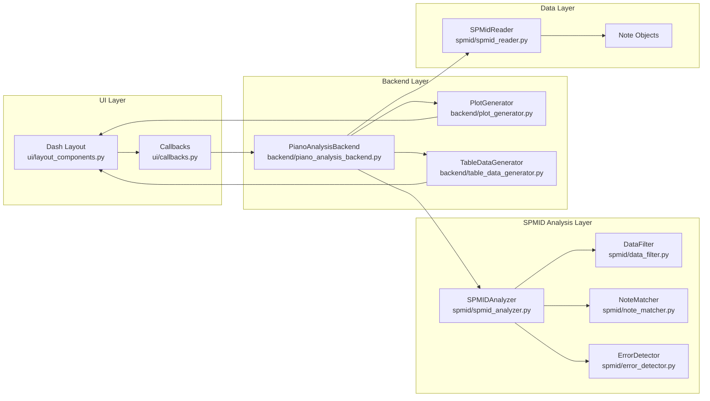
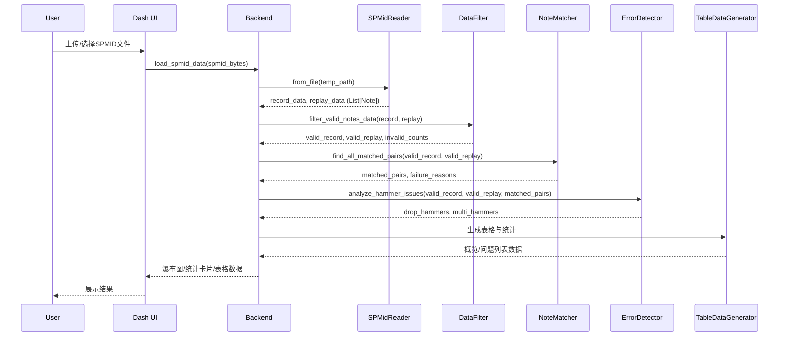

# SPMID数据分析流程文档

## 概述

本文档详细描述SPMID（钢琴数据）分析系统的完整流程，从文件上传、数据解析、过滤、匹配、异常检测到最终UI展示的全链路实现。系统采用模块化架构，确保数据处理的准确性和可维护性。

## 可视化总览

###### 系统架构图

**架构说明**：

系统采用分层架构设计，从底层到顶层依次为数据层（Data Layer）、SPMID分析层（SPMID Analysis Layer）、后端层（Backend Layer）和用户界面层（UI Layer）。数据层负责SPMID文件的二进制解析，通过SPMidReader读取文件结构，解析出Note对象（包含offset、键ID、hammers序列、after_touch序列等），并执行锤速阈值检查以识别不发声音符。SPMID分析层是核心业务逻辑层，包含四个关键组件：SPMIDAnalyzer作为总协调器，负责整个分析流程的编排；DataFilter负责过滤无效音符（空数据、不发声、持续时间过短等）；NoteMatcher实现基于时间误差的贪心匹配算法，确保一对一匹配；ErrorDetector识别丢锤和多锤问题。后端层提供业务服务接口，PianoAnalysisBackend是主要入口，接收UI请求并协调各分析组件，PlotGenerator负责生成瀑布图等可视化图表，TableDataGenerator负责生成各类表格数据，DataManager管理会话状态和临时文件。UI层使用Dash框架构建Web界面，Layout Components定义页面布局和组件，Callbacks处理用户交互和页面更新。整个系统遵循单向数据流：用户操作通过UI层触发，后端层协调各分析模块处理数据，最终将结果返回UI层展示。所有时间数据在内部统一使用0.1ms单位，仅在UI展示时转换为ms，确保计算精度和显示友好性的平衡。



### 端到端时序图

**时序流程详细说明**：

整个系统从用户上传SPMID文件到最终展示分析结果，经历了完整的端到端处理流程。首先，用户通过Dash Web界面上传或选择SPMID文件，触发UI层的文件上传事件。UI层将文件数据（spmid_bytes）传递给后端层的PianoAnalysisBackend，调用load_spmid_data方法。后端首先创建临时文件保存上传的二进制数据，然后调用SPMidReader从文件中读取数据。SPMidReader解析SPMID文件的二进制结构（文件头、索引块、NOTE块等），构造Note对象列表，每个Note包含offset（时间偏移量）、键ID、hammers序列（锤速数据，index为时间戳，value为锤速值）、after_touch序列（触后数据，index为时间戳，value为按键深度）等。读取完成后，返回两条音轨的数据：record_data（录制数据，实际演奏）和replay_data（播放数据，MIDI回放）。接下来，后端调用DataFilter的filter_valid_notes_data方法，对录制和播放数据分别进行有效性过滤。DataFilter检查每个音符的数据完整性（after_touch和hammers不能为空）、不发声检测（首个锤速为0或电机阈值检查失败）、持续时间检查（小于30ms视为过短）。过滤完成后返回有效数据列表和无效统计信息（包含各类型无效原因的数量和不发声音符的详细信息）。随后，后端调用NoteMatcher的find_all_matched_pairs方法执行音符匹配。匹配算法以录制数据为基准，遍历每个录制音符，在播放数据中寻找相同键ID的候选，计算keyon_offset（按键开始时间差）的绝对值作为总误差，根据音符持续时间动态计算阈值（30-50ms范围），过滤并排序候选，采用贪心策略选择第一个未被占用的候选建立匹配对。匹配完成后返回匹配对列表和失败原因字典。接着，后端调用ErrorDetector的analyze_hammer_issues方法识别异常问题。ErrorDetector通过比较已匹配的音符索引集合和原始数据，识别出丢锤（录制有但播放未匹配）和多锤（播放有但录制未匹配），不发声问题则从过滤阶段的silent_notes_details中提取。异常检测完成后，后端调用TableDataGenerator生成各类表格数据，包括统计概览（总音符数、有效音符数、匹配对数、准确率、平均时延等）、丢锤问题列表、多锤问题列表、不发声问题列表、偏移对齐分析表格等。同时，PlotGenerator生成瀑布图，展示录制和播放数据的时间轴对比。最后，后端将所有数据（表格数据、图表、统计信息）返回UI层，UI层进行单位转换（0.1ms转为ms显示）并渲染到页面上，用户可以看到完整的分析结果。



### 按键匹配流程图（动态阈值 + 一对一）

**匹配流程详细说明**：

匹配算法采用以录制数据为基准的贪心匹配策略，严格遵循一对一匹配原则。整个流程从遍历录制数据中的每个音符开始。对于当前处理的录制音符（索引i），首先提取其基本信息（note_info），包括键ID（key_id）、按键开始时间（keyon = after_touch.index[0] + offset）和按键结束时间（keyoff = after_touch.index[-1] + offset），这些时间值均以0.1ms为单位。接着，在播放数据（replay）中筛选出所有与当前录制音符具有相同键ID的音符作为候选集合。对于每个候选音符，算法计算其按键开始时间（current_keyon）与目标录制音符的按键开始时间（target_keyon）的差值，得到keyon_offset = current_keyon - target_keyon，然后将该差值的绝对值作为总误差（total_error = |keyon_offset|）。注意：当前算法仅使用keyon_offset计算误差，不再使用keyoff差或加权组合，这简化了计算逻辑并专注于节奏对齐。随后，算法根据目标音符的持续时间动态计算匹配阈值。基础阈值为500（对应50毫秒），持续时间因子通过公式duration_factor = clamp(0.6, duration/500, 1.0)计算，其中duration = target_keyoff - target_keyon（单位0.1ms）。如果duration <= 0，则判定为异常音符，直接返回失败。最终阈值max_allowed_error = base_threshold × duration_factor，范围在300到500（对应30到50毫秒）之间。时值越长的音符，允许的keyon偏移上限适当增大，但最大不超过50ms，以控制匹配的严格度。算法过滤出总误差在动态阈值范围内的所有候选，并按总误差从小到大进行升序排序，确保最优候选排在前面。接下来进行匹配判断：检查是否存在未被占用的候选（通过used_replay_indices集合追踪已被匹配的播放音符索引）。如果存在未占用的候选，则选择排序后的第一个未占用候选，建立匹配对（记录录制索引、播放索引、两个Note对象），将该候选的索引加入已使用集合（used_replay_indices.add(replay_index)），并记录匹配成功的详细信息到日志（包括键ID、录制和播放索引、时间戳、偏移量、总误差、阈值等）。然后处理下一个录制音符，重复上述流程。如果所有候选都已被占用，或者没有符合条件的候选（即没有相同键ID的音符，或所有候选的总误差都超出动态阈值），则判定当前录制音符匹配失败，记录失败原因到failure_reasons字典（如"所有候选已被占用(候选数:X, 阈值:Yms)"或"时间误差过大(误差:Xms, 阈值:Yms)"），同时记录失败的详细信息到日志，包括前几个候选的时间戳和误差信息。算法继续处理下一个录制音符，直到遍历完所有录制数据。最后，统计匹配结果，输出成功匹配的对数、失败的数量以及匹配成功率（success_count/len(record_data)*100%），完成整个匹配过程。整个流程的核心特点包括：一对一约束（每个播放音符最多匹配一次）、贪心策略（优先选择误差最小的候选）、动态阈值（根据音符特性自适应调整容错范围），确保匹配结果的准确性和唯一性。

```mermaid

```

## 系统架构图（详细层次说明）

**架构分层详细说明**：

本图展示了系统完整的分层架构和各组件之间的调用关系。UI Layer（用户界面层）是用户交互的入口，包含Dash Web Interface作为主界面框架，Layout Components负责定义页面布局结构（包括数据统计概览卡片、瀑布图、问题列表表格、偏移对齐分析表格等），Callbacks处理所有用户交互事件（文件上传、时间范围过滤、图表生成等）。Backend Layer（后端层）提供业务服务和数据转换，PianoAnalysisBackend是核心协调器，接收UI层的请求并协调各个分析组件，管理会话状态和临时文件；PlotGenerator专门负责生成Plotly格式的可视化图表（瀑布图、偏移对齐柱状图等）；TableDataGenerator负责生成各类表格所需的数据格式（统计概览、问题列表、偏移对齐表格等）；DataManager管理数据的加载、缓存和会话状态。SPMID Analysis Layer（SPMID分析层）包含核心业务逻辑，SPMIDAnalyzer作为总协调器，负责编排整个分析流程（数据加载、过滤、匹配、异常检测、统计分析），对外提供统一的接口；DataFilter执行数据有效性过滤，检查音符的完整性、不发声状态、持续时间等，产出有效数据和无效统计；NoteMatcher实现音符匹配算法，基于时间误差进行贪心匹配，确保一对一约束，计算偏移对齐数据和统计信息；ErrorDetector识别异常问题（丢锤、多锤），并分析匹配失败的原因；TimeAligner提供时间对齐相关功能（已废弃DTW算法，当前不使用）。Data Layer（数据层）负责数据读取和基础验证，SPMidReader解析SPMID二进制文件，读取文件头、索引块、NOTE块等，构造Note对象；Note Objects是数据模型，包含offset、键ID、hammers序列、after_touch序列等；MotorThresholdChecker检查电机阈值，用于识别不发声音符。各层之间的调用关系清晰：UI层通过Callbacks调用Backend层的接口，Backend层协调SPMID分析层的各个组件，分析层组件依赖数据层进行数据读取和验证，最终数据流回UI层进行展示。这种分层设计实现了关注点分离，提高了系统的可维护性和可扩展性。

```mermaid
flowchart TB
    subgraph "UI Layer"
        A[Dash Web Interface]
        B[Layout Components]
        C[Callbacks]
    end

    subgraph "Backend Layer"
        D[PianoAnalysisBackend]
        E[PlotGenerator]
        F[TableDataGenerator]
        G[DataManager]
    end

    subgraph "SPMID Analysis Layer"
        H[SPMIDAnalyzer]
        I[DataFilter]
        J[NoteMatcher]
        K[ErrorDetector]
        L[TimeAligner]
    end

    subgraph "Data Layer"
        M[SPMIDReader]
        N[MotorThresholdChecker]
        O[Note Objects]
    end

    A --> B
    B --> C
    C --> D
    D --> E
    D --> F
    D --> G
    D --> H
    H --> I
    H --> J
    H --> K
    H --> L
    I --> M
    J --> M
    K --> M
    M --> O
    I --> N
```

## 数据单位规范

**重要**：系统内部统一使用0.1ms作为时间单位，仅在UI展示时转换为ms（除以10）。

- 内部计算：所有时间戳、偏移量、持续时间均以0.1ms为单位
- UI显示：时间相关数据除以10显示为ms
- 日志输出：关键时间信息同时显示0.1ms和ms两种单位

## 1. 数据读取阶段

### 1.1 文件上传与解析

**入口函数**：`backend/piano_analysis_backend.py:load_spmid_data()`

```python
def load_spmid_data(self, spmid_bytes: bytes) -> bool:
    """加载SPMID数据的主入口"""
    try:
        # 1. 创建临时文件
        temp_file_path = self._create_temp_file(spmid_bytes)

        # 2. 加载轨道数据
        record_data, replay_data = self._load_track_data(temp_file_path)

        # 3. 执行完整分析
        self._perform_error_analysis(record_data, replay_data)

        # 4. 更新时间范围
        self._update_time_range()

        return True
    finally:
        # 5. 清理临时文件
        self._cleanup_temp_file(temp_file_path)
```

### 1.2 轨道数据加载

**核心函数**：`_load_track_data(temp_file_path)`

```python
def _load_track_data(self, temp_file_path: str) -> Tuple[List[Note], List[Note]]:
    """加载SPMID文件的轨道数据"""
    reader = SPMidReader.from_file(temp_file_path, verbose=False)

    # 验证轨道数量
    if reader.get_track_count < 2:
        raise ValueError("SPMID文件必须包含至少2个轨道")

    # 获取录制和播放数据
    record_data = reader.get_track(0)  # 录制数据（实际演奏）
    replay_data = reader.get_track(1)  # 播放数据（MIDI回放）

    return record_data, replay_data
```

### 1.3 Note数据结构

**定义位置**：`spmid/spmid_reader.py`

```python
@dataclass
class Note:
    offset: int                    # 时间偏移量（0.1ms单位）
    id: int                       # 键ID（1-88）
    finger: int                   # 手指编号
    hammers: pd.Series           # 锤速数据：index=时间戳, value=锤速
    uuid: str                    # 唯一标识符
    velocity: int                # 初始速度
    after_touch: pd.Series       # 触后数据：index=时间戳, value=按键深度
```

**关键属性**：

- `hammers.index`：锤击时间戳（相对offset，0.1ms单位）
- `hammers.values`：锤击速度值
- `after_touch.index`：触后时间戳（相对offset，0.1ms单位）
- `after_touch.values`：按键深度值

## 2. 数据过滤阶段

### 2.1 过滤流程概览

**过滤流程详细说明**：

数据过滤阶段是分析流程的关键预处理步骤，其目的是从原始SPMID数据中筛选出有效的音符，剔除无效或异常的数据，为后续的匹配和分析提供高质量的数据基础。过滤流程对录制数据（record_data）和播放数据（replay_data）分别进行相同的有效性检查，确保两个数据集的一致性。整个过滤过程通过`filter_valid_notes_data`方法协调，该方法首先调用`_filter_valid_notes_with_details`对录制数据进行过滤，返回有效录制数据列表和无效统计信息（包括各类无效原因的数量和不发声音符的详细信息）。然后对播放数据执行相同的过滤操作，返回有效播放数据列表和对应的无效统计信息。最后，将录制和播放的无效统计信息合并到一个字典中，统一返回给调用者。过滤过程会统计四种无效原因：empty_data（数据为空，after_touch或hammers序列为空）、silent_notes（不发声音符，锤速为0或电机阈值检查失败）、duration_too_short（持续时间过短，小于30ms）以及valid（有效音符）。对于不发声音符，系统会特别保存详细信息（silent_notes_details），包括音符索引、Note对象本身和数据类型（record或replay），这些信息将在后续的异常检测阶段用于生成"不发声"问题列表。过滤完成后的有效数据将进入匹配阶段，无效统计数据将用于生成问题列表和统计概览。

**入口函数**：`spmid/data_filter.py:filter_valid_notes_data()`

```python
def filter_valid_notes_data(self, record_data: List[Note], replay_data: List[Note]) -> Tuple[List[Note], List[Note], Dict[str, Any]]:
    """过滤有效音符数据的主函数"""

    # 1. 过滤录制数据
    valid_record_data, record_invalid_counts = self._filter_valid_notes_with_details(record_data, "record")

    # 2. 过滤播放数据
    valid_replay_data, replay_invalid_counts = self._filter_valid_notes_with_details(replay_data, "replay")

    # 3. 合并统计信息
    invalid_counts = {
        'record_data': record_invalid_counts,
        'replay_data': replay_invalid_counts
    }

    return valid_record_data, valid_replay_data, invalid_counts
```

### 2.2 有效性判定规则

**有效性判定详细说明**：

有效性判定通过`_is_note_valid_with_reason`方法实现，该方法对单个音符进行多层次的检查，按照优先级顺序逐步验证，一旦发现无效情况立即返回。判定的优先级顺序为：数据完整性检查（最高优先级）、锤速检查、持续时间检查、电机阈值检查。首先进行数据完整性检查：如果音符的after_touch序列或hammers序列为空（长度为0），则判定为无效，返回原因'empty_data'。数据完整性是最基本的检查，确保后续检查能够正常进行。接下来进行锤速检查（优先级最高）：获取hammers序列的第一个值（first_hammer_velocity），如果该值为0，说明这是一个不发声音符，立即判定为无效，返回原因'silent_notes'，并记录日志信息。锤速为0通常表示键盘未被正确触发或传感器故障。然后进行持续时间检查：计算音符的持续时间duration = after_touch.index[-1] - after_touch.index[0]（单位0.1ms），如果duration < 300（即小于30ms），则判定为持续时间过短，返回原因'duration_too_short'。小于30ms的音符在真实钢琴演奏中极为罕见，通常是误触、噪声或数据采集错误导致的，因此被视为无效。最后进行电机阈值检查：如果系统配置了MotorThresholdChecker（电机阈值检查器），则根据音符的键ID构造对应的电机名称（motor_{note.id}），调用阈值检查器验证首个锤速值是否超过该电机的启动阈值。如果阈值检查失败，说明该音符的锤速虽然不为0，但未达到电机的有效触发阈值，同样判定为不发声音符，返回原因'silent_notes'，并记录日志。所有检查通过后，返回True和'valid'，表示该音符有效。整个判定过程采用短路逻辑，一旦发现无效情况立即返回，避免不必要的计算。

**核心函数**：`_is_note_valid_with_reason()`

```python
def _is_note_valid_with_reason(self, note: Note) -> Tuple[bool, str]:
    """判定音符是否有效，返回(是否有效, 无效原因)"""

    # 1. 数据完整性检查
    if len(note.after_touch) == 0 or len(note.hammers) == 0:
        return False, 'empty_data'

    # 2. 锤速检查（优先级最高）
    first_hammer_velocity = note.hammers.values[0]
    if first_hammer_velocity == 0:
        logger.info(f"🔇 发现不发声音符: 音符ID={note.id}, 锤速={first_hammer_velocity}")
        return False, 'silent_notes'

    # 3. 持续时间检查
    duration = note.after_touch.index[-1] - note.after_touch.index[0]
    if duration < 300:  # 30ms（300 * 0.1ms）
        return False, 'duration_too_short'

    # 4. 电机阈值检查
    if self.threshold_checker:
        motor_name = f"motor_{note.id}"
        is_valid = self.threshold_checker.check_threshold(first_hammer_velocity, motor_name)
        if not is_valid:
            logger.info(f"🔇 音符ID={note.id} 被识别为不发声音符: 阈值检查失败, 锤速={first_hammer_velocity}")
            return False, 'silent_notes'

    return True, 'valid'
```

### 2.3 过滤统计与详情

**统计分类**：

- `empty_data`：数据为空（after_touch或hammers为空）
- `silent_notes`：不发声音符（锤速为0或阈值检查失败）
- `duration_too_short`：持续时间过短（<30ms）
- `valid`：有效音符

**特殊处理**：`silent_notes_details`

- 存储不发声音符的详细信息（index, note, data_type）
- 用于后续生成"不发声"问题列表

## 3. 音符匹配阶段

### 3.1 匹配算法概述

**核心思想**：基于时间误差的贪心匹配算法，确保一对一匹配

**算法特点**：

- 以录制数据为基准，在播放数据中寻找匹配
- 键ID必须相同
- 基于动态阈值的时间误差匹配
- 一对一约束：每个播放音符最多匹配一次

### 3.2 匹配流程详解

**入口函数**：`spmid/note_matcher.py:find_all_matched_pairs()`

```python
def find_all_matched_pairs(self, record_data: List[Note], replay_data: List[Note]) -> List[Tuple[int, int, Note, Note]]:
    """以录制数据为基准，在播放数据中寻找匹配的音符对"""

    matched_pairs = []
    used_replay_indices = set()  # 防止重复匹配
    self.failure_reasons.clear()  # 清空失败原因

    logger.info(f"🎯 开始音符匹配: 录制数据{len(record_data)}个音符, 回放数据{len(replay_data)}个音符")

    # 遍历录制数据中的每个音符
    for i, record_note in enumerate(record_data):
        # 1. 提取音符信息
        note_info = self._extract_note_info(record_note, i)

        # 2. 生成候选列表
        candidates, threshold, reason_if_empty = self._generate_sorted_candidates_within_threshold(
            replay_data, note_info["keyon"], note_info["keyoff"], note_info["key_id"]
        )

        # 3. 选择最佳匹配
        chosen = None
        for cand in candidates:
            if cand['index'] not in used_replay_indices:
                chosen = cand
                break

        # 4. 处理匹配结果
        if chosen is not None:
            # 匹配成功
            replay_index = chosen['index']
            matched_pairs.append((i, replay_index, record_note, replay_data[replay_index]))
            used_replay_indices.add(replay_index)

            # 记录成功日志
            self._log_match_success(record_note, replay_data[replay_index], i, replay_index, chosen, threshold)
        else:
            # 匹配失败
            reason = f"所有候选已被占用(候选数:{len(candidates)}, 阈值:{threshold:.1f}ms)" if candidates else reason_if_empty
            self.failure_reasons[("record", i)] = reason
            self._log_match_failure(record_note, i, reason, candidates)

    # 记录匹配统计
    success_count = len(matched_pairs)
    failure_count = len(record_data) - success_count
    logger.info(f"🎯 音符匹配完成: 成功匹配{success_count}对, 失败{failure_count}个, 成功率{success_count/len(record_data)*100:.1f}%")

    self.matched_pairs = matched_pairs
    return matched_pairs
```

### 3.3 音符信息提取

**函数**：`_extract_note_info()`

```python
def _extract_note_info(self, note: Note, index: int) -> Dict:
    """提取音符基本信息"""

    # 计算绝对时间戳（0.1ms单位）
    absolute_keyon = note.after_touch.index[0] + note.offset
    absolute_keyoff = note.after_touch.index[-1] + note.offset

    return {
        'keyon': absolute_keyon,      # 按键开始时间
        'keyoff': absolute_keyoff,    # 按键结束时间
        'key_id': note.id,           # 键ID
        'index': index               # 音符索引
    }
```

### 3.4 候选生成与筛选

**核心函数**：`_generate_sorted_candidates_within_threshold()`

```python
def _generate_sorted_candidates_within_threshold(self, notes_list: List[Note], target_keyon: float, target_keyoff: float, target_key_id: int) -> Tuple[List[Dict[str, float]], float, str]:
    """生成在动态阈值内的候选列表（按总误差升序）"""

    # 1. 筛选相同键ID的音符
    matching = []
    for idx, note in enumerate(notes_list):
        if getattr(note, 'id', None) == target_key_id:
            matching.append((idx, note))

    if not matching:
        return [], 0.0, f"没有找到键ID {target_key_id} 的音符"

    # 2. 计算每个候选的误差（只使用keyon_offset）
    candidates = []
    for idx, note in matching:
        # 计算候选音符的时间
            current_keyon = note.after_touch.index[0] + note.offset
            current_keyoff = note.after_touch.index[-1] + note.offset

        # 计算时间误差（只使用keyon_offset）
        keyon_offset = current_keyon - target_keyon
        total_error = abs(keyon_offset)  # 只使用keyon_offset的绝对值

        candidates.append({
            'index': idx,
            'total_error': total_error,
            'keyon_error': abs(keyon_offset)
        })

    # 3. 动态阈值计算
    base_threshold = 500.0  # 基础阈值：500 * 0.1ms = 50ms
    duration = (target_keyoff - target_keyon)
    if duration <= 0:
        return [], 0.0, "无效持续时间(≤0)，疑似异常音符"
    duration_factor = min(1.0, max(0.6, duration / 500.0))  # 持续时间因子：0.6-1.0
    max_allowed_error = base_threshold * duration_factor  # 实际阈值：300-500 * 0.1ms (30-50ms)

    # 4. 过滤并排序
    within_threshold = [c for c in candidates if c['total_error'] <= max_allowed_error]
    within_threshold.sort(key=lambda x: x['total_error'])

    if not within_threshold:
        best_total = min(c['total_error'] for c in candidates)
        return [], max_allowed_error, f"时间误差过大(误差:{best_total:.1f}ms, 阈值:{max_allowed_error:.1f}ms)"

    return within_threshold, max_allowed_error, ""
```

### 3.5 匹配日志记录

**成功匹配日志**：

```
✅ 匹配成功: 键ID=60, 录制索引=0, 回放索引=0, 录制时间=(100.50ms, 200.30ms), 回放时间=(102.10ms, 201.80ms), 偏移=(1.60ms, 1.50ms), 总误差=1.60ms, 阈值=45.00ms
```

**失败匹配日志**：

```
❌ 匹配失败: 键ID=61, 录制索引=1, 录制时间=(250.20ms, 350.10ms), 原因: 所有候选已被占用(候选数:2, 阈值:45.0ms)
   候选1: 回放索引=5, 回放时间=(252.30ms, 352.20ms), 总误差=2.30ms
   候选2: 回放索引=8, 回放时间=(248.90ms, 348.70ms), 总误差=1.10ms
```

**注意**：总误差现在只使用 `keyon_offset` 的绝对值，阈值范围为30-50ms。

## 4. 异常检测阶段

### 4.1 异常类型定义

**丢锤（Drop Hammer）**：录制数据中有音符，但播放数据中没有对应的音符
**多锤（Multi Hammer）**：播放数据中有音符，但录制数据中没有对应的音符
**不发声（Silent Hammer）**：锤速为0或电机阈值检查失败的音符

### 4.2 异常检测流程

**异常检测流程详细说明**：

异常检测阶段是分析流程的重要环节，其目的是识别和分析匹配过程中的异常情况，包括丢锤（Drop Hammer）、多锤（Multi Hammer）和不发声（Silent Hammer）三类问题。检测流程通过`analyze_hammer_issues`方法实现，该方法接收三个参数：record_data（录制数据列表）、replay_data（播放数据列表）和matched_pairs（已匹配的音符对列表）。首先，从matched_pairs中提取所有已匹配的录制音符索引和播放音符索引，分别形成matched_record_indices和matched_replay_indices两个集合。这两个集合用于快速判断某个音符是否已被成功匹配。接下来进行丢锤检测（Drop Hammer Detection）：遍历录制数据（record_data）中的所有音符，检查每个音符的索引是否在matched_record_indices集合中。如果不在，说明该录制音符在播放数据中找不到对应的匹配，即录制数据中有音符但播放数据中没有，这被称为"丢锤"。对于每个丢锤音符，系统通过`_create_error_note`方法创建一个ErrorNote对象，包含音符的详细信息（索引、键ID、按键开始/结束时间等），并将错误类型设置为"丢锤"，然后添加到drop_hammers列表中。然后进行多锤检测（Multi Hammer Detection）：遍历播放数据（replay_data）中的所有音符，检查每个音符的索引是否在matched_replay_indices集合中。如果不在，说明该播放音符在录制数据中找不到对应的匹配，即播放数据中有音符但录制数据中没有，这被称为"多锤"。对于每个多锤音符，同样创建ErrorNote对象，设置错误类型为"多锤"，并添加到multi_hammers列表中。不发声检测（Silent Hammer Detection）则是在过滤阶段完成的，相关信息存储在invalid_counts的silent_notes_details中，通过`_extract_silent_hammers_from_invalid_counts`方法提取。最终返回drop_hammers和multi_hammers两个列表，这些信息将用于生成问题列表表格，帮助用户快速定位和分析异常情况。异常检测结果还会与匹配失败原因（failure_reasons）结合，在问题列表中显示详细的失败分析原因，如"所有候选已被占用"或"时间误差过大"等，为用户提供更全面的诊断信息。

**入口函数**：`spmid/error_detector.py:analyze_hammer_issues()`

```python
def analyze_hammer_issues(self, record_data: List[Note], replay_data: List[Note], matched_pairs: List[Tuple[int, int, Note, Note]]) -> Tuple[List[ErrorNote], List[ErrorNote]]:
    """分析锤子问题：丢锤和多锤"""

    # 1. 获取已匹配的音符索引
    matched_record_indices = set(pair[0] for pair in matched_pairs)
    matched_replay_indices = set(pair[1] for pair in matched_pairs)

    # 2. 识别丢锤（录制有，播放无）
    drop_hammers = []
    for i, note in enumerate(record_data):
        if i not in matched_record_indices:
            error_note = self._create_error_note(note, i, "丢锤")
            drop_hammers.append(error_note)

    # 3. 识别多锤（播放有，录制无）
    multi_hammers = []
    for i, note in enumerate(replay_data):
        if i not in matched_replay_indices:
            error_note = self._create_error_note(note, i, "多锤")
            multi_hammers.append(error_note)

    return drop_hammers, multi_hammers
```

### 4.3 不发声检测

**实现位置**：`spmid/spmid_analyzer.py:_extract_silent_hammers_from_invalid_counts()`

```python
def _extract_silent_hammers_from_invalid_counts(self, invalid_counts: Dict[str, Any]) -> List[ErrorNote]:
    """从过滤结果中提取不发声的音符详情"""

    silent_hammers = []

    # 处理录制和播放数据中的不发声音符
    for data_type in ['record_data', 'replay_data']:
        silent_details = invalid_counts.get(data_type, {}).get('silent_notes_details', [])

        for item in silent_details:
            note = item['note']
            index = item['index']

            # 计算时间信息
            keyon_time = note.after_touch.index[0] + note.offset if len(note.after_touch) > 0 else 0
            keyoff_time = note.after_touch.index[-1] + note.offset if len(note.after_touch) > 0 else 0

            # 创建错误音符对象
            error_note = ErrorNote(
                infos=[NoteInfo(index=index, keyId=note.id, keyOn=keyon_time, keyOff=keyoff_time)],
                diffs=[],
                error_type="不发声",
                global_index=index
            )
            silent_hammers.append(error_note)

    return silent_hammers
```

## 5. 统计分析阶段

### 5.1 偏移对齐数据计算

**偏移对齐计算详细说明**：

偏移对齐数据计算是统计分析阶段的第一步，其目的是为每个成功匹配的音符对计算详细的时间偏移信息，为后续的统计分析和可视化提供数据基础。计算过程通过`get_offset_alignment_data`方法实现，该方法遍历所有已匹配的音符对（matched_pairs）。对于每一对匹配的音符（record_note和replay_note），首先通过`_calculate_note_times`方法计算两个音符的关键时间点：录制音符的按键开始时间（record_keyon = record_note.after_touch.index[0] + record_note.offset）和按键结束时间（record_keyoff = record_note.after_touch.index[-1] + record_note.offset），播放音符的按键开始时间（replay_keyon = replay_note.after_touch.index[0] + replay_note.offset）和按键结束时间（replay_keyoff = replay_note.after_touch.index[-1] + replay_note.offset）。所有时间值均以0.1ms为单位，是绝对时间戳。接下来计算偏移量：keyon_offset = replay_keyon - record_keyon（播放按键开始时间相对于录制按键开始时间的偏移），这个值可以为正（播放延迟）或负（播放提前）。同时计算持续时间：record_duration = record_keyoff - record_keyon（录制音符的持续时间），replay_duration = replay_keyoff - replay_keyon（播放音符的持续时间），以及持续时间差：duration_offset = replay_duration - record_duration（播放持续时间相对于录制持续时间的变化）。虽然duration_offset会被计算和保存，但当前系统的average_offset只使用keyon_offset的绝对值：avg_offset = |keyon_offset|。这样设计的原因是节奏对齐（keyon时机）在钢琴演奏中占据主导地位，听感上更敏感，而duration差异虽然也重要，但主要用于形态分析，不参与匹配决策和全局平均时延的统计计算，避免口径混杂。最终，为每个匹配对生成一个包含完整信息的字典，包括：record_index（录制音符索引）、replay_index（播放音符索引）、key_id（键ID）、record_keyon/keyoff（录制时间点）、replay_keyon/keyoff（播放时间点）、keyon_offset（按键开始时间偏移）、duration_offset（持续时间差）、average_offset（平均偏移，即|keyon_offset|）、record_duration/replay_duration（持续时间）等。所有这些数据都以0.1ms为单位，在UI展示时才会转换为ms。偏移对齐数据将用于生成偏移对齐分析表格、计算统计信息（中位数、均值、标准差）以及计算全局平均时延。

**核心函数**：`spmid/note_matcher.py:get_offset_alignment_data()`

计算每个匹配对的时间偏移信息，只使用 `keyon_offset` 计算 `average_offset`。

```python
def get_offset_alignment_data(self) -> List[Dict[str, Any]]:
    """获取偏移对齐数据 - 计算每个匹配对的时间偏移"""

    offset_data = []

    for record_idx, replay_idx, record_note, replay_note in self.matched_pairs:
        # 计算录制和播放音符的时间
        record_keyon, record_keyoff = self._calculate_note_times(record_note)
        replay_keyon, replay_keyoff = self._calculate_note_times(replay_note)

        # 计算偏移量：只使用keyon_offset
        keyon_offset = replay_keyon - record_keyon
        record_duration = record_keyoff - record_keyon
        replay_duration = replay_keyoff - replay_keyon
        duration_offset = replay_duration - record_duration

        # 只使用keyon_offset计算average_offset
        avg_offset = abs(keyon_offset)

        offset_data.append({
            'record_index': record_idx,
            'replay_index': replay_idx,
            'key_id': record_note.id,
            'record_keyon': record_keyon,
            'replay_keyon': replay_keyon,
            'keyon_offset': keyon_offset,
            'record_keyoff': record_keyoff,
            'replay_keyoff': replay_keyoff,
            'duration_offset': duration_offset,
            'average_offset': avg_offset,  # 只使用keyon_offset
            'record_duration': record_duration,
            'replay_duration': replay_duration
        })

    return offset_data
```

### 5.2 偏移统计计算

**偏移统计计算详细说明**：

偏移统计计算是对偏移对齐数据进行聚合分析的过程，其目的是从整体上了解匹配音符对的时间偏移特征，为性能评估和问题诊断提供统计依据。计算过程通过`get_offset_statistics`方法实现，该方法首先检查是否存在已匹配的音符对，如果没有匹配对则返回空的统计信息（所有统计值均为0.0）。如果有匹配对，则先调用`get_offset_alignment_data`获取所有匹配对的偏移对齐数据。接下来，从偏移对齐数据中提取三类偏移值列表：第一类是keyon_offsets，直接从每项的'keyon_offset'字段提取（这些值可以为正或负，表示播放相对于录制的提前或延迟）；第二类是duration_offsets，从每项的'duration_offset'字段提取（表示持续时间的变化，正值为播放持续时间更长，负值为播放持续时间更短）；第三类是overall_offsets，提取每项的'keyon_offset'的绝对值（即|keyon_offset|），用于整体统计。注意：虽然duration_offsets会被提取和统计，但overall_offset_stats（整体偏移统计）只使用keyon_offset的绝对值，不混入duration偏差，这确保了统计口径的清晰性和一致性。对于每个偏移值列表，系统调用`_calculate_offset_stats`方法计算统计信息，包括：average（平均值，即算术平均）、max（最大值）、min（最小值）、std（标准差，用于衡量数据的离散程度）。`_calculate_offset_stats`方法使用样本标准差公式：std = sqrt(sum((x - average)^2) / (n - 1))，其中n为数据点的数量。注意：`get_offset_statistics`返回的标准差使用样本定义（n-1），而数据概览页面显示的总体标准差使用`get_standard_deviation()`方法，该方法使用总体定义（n）且基于绝对误差计算。最终返回一个包含总匹配对数（total_pairs）和三类统计信息（keyon_offset_stats、duration_offset_stats、overall_offset_stats）的字典。这些统计信息将被用于生成数据统计概览卡片，在UI中展示，帮助用户快速了解整体匹配质量和时间偏移特征。

**核心函数**：`spmid/note_matcher.py:get_offset_statistics()`

```python
def get_offset_statistics(self) -> Dict[str, Any]:
    """获取偏移统计信息"""

    if not self.matched_pairs:
        return {
            'total_pairs': 0,
            'keyon_offset_stats': {'average': 0.0, 'max': 0.0, 'min': 0.0, 'std': 0.0},
            'duration_offset_stats': {'average': 0.0, 'max': 0.0, 'min': 0.0, 'std': 0.0},
            'overall_offset_stats': {'average': 0.0, 'max': 0.0, 'min': 0.0, 'std': 0.0}
        }

    # 获取偏移数据
    offset_data = self.get_offset_alignment_data()

    # 提取偏移值（只使用keyon_offset）
    keyon_offsets = [item['keyon_offset'] for item in offset_data]
    duration_offsets = [item.get('duration_offset', 0.0) for item in offset_data]
    # 整体统计只使用keyon_offset的绝对值
    overall_offsets = [abs(item.get('keyon_offset', 0)) for item in offset_data if item.get('keyon_offset') is not None]

    return {
        'total_pairs': len(self.matched_pairs),
        'keyon_offset_stats': self._calculate_offset_stats(keyon_offsets),
        'duration_offset_stats': self._calculate_offset_stats(duration_offsets),
        'overall_offset_stats': self._calculate_offset_stats(overall_offsets)  # 只使用keyon_offset
    }
```

### 5.3 全局平均时延计算

**全局平均时延计算详细说明**：

全局平均时延是系统最重要的性能指标之一，用于评估整首曲子的总体时间对齐质量。计算过程通过`get_global_average_delay`方法实现，该方法首先检查是否存在已匹配的音符对，如果没有则直接返回0.0。如果有匹配对，则调用`get_offset_alignment_data`方法获取所有匹配对的偏移对齐数据。接下来，从偏移对齐数据中提取所有keyon_offset的绝对值，形成keyon_errors列表，即[abs(item['keyon_offset']) for item in offset_data]。注意：系统只使用keyon_offset的绝对值计算全局平均时延，不使用duration_offset，也不使用加权平均，这确保了指标口径的简洁性和可解释性。原因在于节奏对齐（keyon时机）在钢琴演奏中占据主导地位，是影响听感的关键因素，而duration差异虽然也重要，但主要用于形态分析，不参与全局性能评估。如果keyon_errors列表为空（理论上不应该发生，但代码做了防御性检查），则返回0.0。否则，计算算术平均值：average_delay = sum(keyon_errors) / len(keyon_errors)，单位仍然是0.1ms。计算完成后，记录日志信息，显示平均时延（转换为ms显示）和基于的匹配对数量。最终返回average_delay（0.1ms单位），该值将被后端层接收并原样传递给UI层，UI层在显示时除以10转换为ms单位。全局平均时延的计算调用链为：UI层调用Backend的`get_global_average_delay()`，Backend调用Analyzer的`get_global_average_delay()`，Analyzer调用NoteMatcher的`get_global_average_delay()`，NoteMatcher内部调用`get_offset_alignment_data()`获取偏移数据，然后提取并计算平均值，最终按原路返回。整个过程保证了数据的一致性（内部0.1ms单位）和显示的用户友好性（UI层ms单位）。

**调用链说明**：

全局平均时延的计算涉及多层调用，具体流程如下：1) UI层（Dash界面）需要显示平均时延时，调用后端PianoAnalysisBackend的`get_global_average_delay()`方法；2) 后端层接收请求后，直接调用SPMIDAnalyzer的`get_global_average_delay()`方法，不做任何单位转换，保持0.1ms内部单位；3) SPMIDAnalyzer作为协调器，检查是否有NoteMatcher实例，如果有则调用NoteMatcher的`get_global_average_delay()`方法，否则返回0.0；4) NoteMatcher执行实际计算：首先调用自身的`get_offset_alignment_data()`方法获取所有匹配对的偏移对齐数据，该方法遍历matched_pairs，为每对计算keyon_offset、duration_offset等，并生成完整的偏移数据列表；然后从偏移数据中提取所有keyon_offset的绝对值，形成keyon_errors列表；计算算术平均值average_delay = sum(keyon_errors) / len(keyon_errors)，单位0.1ms；记录日志；返回average_delay；5) 返回值按原路径返回：NoteMatcher → SPMIDAnalyzer → PianoAnalysisBackend → UI层；6) UI层接收到0.1ms单位的值后，在显示时除以10转换为ms单位，展示给用户。整个调用链确保了数据的一致性（内部计算全程使用0.1ms）和显示的用户友好性（UI层统一转换为ms），避免了多次单位转换导致的数据精度损失。

**核心函数**：`spmid/note_matcher.py:get_global_average_delay()`

```python
def get_global_average_delay(self) -> float:
    """计算整首曲子的平均时延（基于已配对数据）

    只使用 keyon_offset 计算：全局平均时延 = mean(|keyon_offset|)
    """

    if not self.matched_pairs:
        return 0.0

    # 获取偏移数据
    offset_data = self.get_offset_alignment_data()

    # 只使用keyon_offset的绝对值
    keyon_errors = [abs(item.get('keyon_offset', 0)) for item in offset_data if item.get('keyon_offset') is not None]

    if not keyon_errors:
        return 0.0

    # 计算平均值（0.1ms单位）
    average_delay = sum(keyon_errors) / len(keyon_errors)

    logger.info(f"📊 整首曲子平均时延(keyon): {average_delay/10:.2f}ms (基于{len(keyon_errors)}个匹配对)")

    return average_delay  # 返回0.1ms单位
```

### 5.4 评价指标与统计口径（含数学公式）

本节统一给出各评价指标的定义、公式、单位和数据口径，确保统计含义一致且可复现。

#### 数据口径（统一说明）

- 仅使用"已匹配按键对"（matched_pairs）。

- 单个样本的带符号偏差定义为：
  
  $$
  ( x_i = \mathrm{replay\_keyon}_i - \mathrm{record\_keyon}_i)（内部单位0.1ms，展示时除以10为ms）。
  $$

- 不纳入未匹配样本（丢锤/多锤/不发声）。

#### 评价指标详细说明

系统提供以下评价指标，用于全面评估延时对齐质量。所有指标均基于已匹配按键对（matched_pairs）计算。

**符号定义**：


$$
设 ( n ) 为已匹配按键对的数量，( i \in \{1, 2, \ldots, n\} ) 为匹配对索引。
$$

对于第 \( i \) 个匹配对，定义：

$$
( t_{\text{record},i})：录制数据的按键开始时间（单位：0.1ms）
$$

$$
( t_{\text{replay},i})：播放数据的按键开始时间（单位：0.1ms）
$$

$$
( x_i = t_{\text{replay},i} - t_{\text{record},i})：带符号的时间偏移量（单位：0.1ms）
$$

$$
( y_i = |x_i|)：绝对时间偏移量（单位：0.1ms）
$$

**指标分类**：

根据分析目标，指标分为两类：

1. **用于"时延与按键的关系"分析**：使用绝对误差 \( y_i \)，关注误差大小，不考虑提前/滞后方向
2. **用于系统性偏差分析**：使用带符号值 \( x_i \)，反映整体提前/滞后方向性

---

##### 1. 总体均值（Population Mean）

- **定义**：所有已匹配按键对的 keyon_offset 的算术平均，反映整体提前/滞后方向性
- **用途**：分析系统性偏差（正值表示 replay 整体延迟，负值表示 replay 整体提前）
- $$
  公式： \mu = \frac{1}{n} \sum_{i=1}^{n} x_i = \frac{1}{n} \sum_{i=1}^{n} (t_{\text{replay},i} - t_{\text{record},i})
  $$
- **数据来源**：使用带符号的 `keyon_offset`（即 \( x_i \)，可能为正或负）
- **单位**：内部 0.1ms；UI 显示 ms（÷10）
- **代码实现**：`spmid/note_matcher.py:get_mean_error()`
- **UI显示**：数据概览页面的"总体均值"

---

##### 2. 平均绝对误差（MAE，Mean Absolute Error） / 平均延时

- **定义**：偏差绝对值的平均，衡量平均偏差规模，不考虑方向性
- **用途**：用于"时延与按键的关系"分析，反映误差大小
- **数学公式**：
  \[
  \mathrm{MAE} = \frac{1}{n} \sum_{i=1}^{n} y_i = \frac{1}{n} \sum_{i=1}^{n} |x_i| = \frac{1}{n} \sum_{i=1}^{n} |t_{\text{replay},i} - t_{\text{record},i}|
  \]
- **数据来源**：使用绝对值的 `keyon_offset`（即 \( y_i = |x_i| \)）
- **单位**：内部 0.1ms；UI 显示 ms（÷10）
- **代码实现**：`spmid/note_matcher.py:get_mean_absolute_error()`
- **UI显示**：数据概览页面的"平均延时（绝对值口径，等同MAE）"
- **说明**：与总体均值的区别在于，MAE 不考虑方向性，只反映误差的幅度大小

---

##### 3. 均方误差（MSE，Mean Squared Error）

- **定义**：偏差平方的平均，对大偏差更敏感
- **用途**：分析误差的平方特性，对大偏差给予更高权重
- **数学公式**：
  \[
  \mathrm{MSE} = \frac{1}{n} \sum_{i=1}^{n} x_i^2 = \frac{1}{n} \sum_{i=1}^{n} (t_{\text{replay},i} - t_{\text{record},i})^2
  \]
- **数据来源**：使用带符号的 `keyon_offset` 的平方（即 \( x_i^2 \)）
- **单位**：内部 (0.1ms)²；UI 显示 ms²（÷100）
- **代码实现**：`spmid/note_matcher.py:get_mean_squared_error()`
- **UI显示**：数据概览页面的"均方误差(MSE)"

---

##### 4. 总体方差（Population Variance）

- **定义**：以 \(n\) 为分母的方差，刻画绝对误差的离散程度
- **用途**：用于"时延与按键的关系"分析，反映误差大小的离散程度

**标准总体方差公式**（使用带符号值）：
\[
\sigma^2 = \frac{1}{n} \sum_{i=1}^{n} (x_i - \mu)^2
\]
其中：
\[
\mu = \frac{1}{n} \sum_{i=1}^{n} x_i
\]

**完全展开式**：
\[
\sigma^2 = \frac{1}{n} \left[ (x_1 - \mu)^2 + (x_2 - \mu)^2 + \cdots + (x_n - \mu)^2 \right]
\]

**本项目实现的总体方差公式**（使用绝对值）：
\[
\sigma^2 = \frac{1}{n} \sum_{i=1}^{n} (|x_i| - \mu_{\text{abs}})^2
\]
其中：
\[
\mu_{\text{abs}} = \frac{1}{n} \sum_{i=1}^{n} |x_i|
\]

**完全展开式**：
\[
\sigma^2 = \frac{1}{n} \left[ (|x_1| - \mu_{\text{abs}})^2 + (|x_2| - \mu_{\text{abs}})^2 + \cdots + (|x_n| - \mu_{\text{abs}})^2 \right]
\]
其中：
\[
\mu_{\text{abs}} = \frac{1}{n} \left( |x_1| + |x_2| + \cdots + |x_n| \right)
\]

**重要说明**：本项目**使用绝对值** \(|x_i|\) 计算总体方差，而非标准公式中的带符号值 \(x_i\)。这样做的目的是用于分析"时延与按键的关系"（关注误差大小而非提前/滞后方向）。

- **数据来源**：对所有匹配对的绝对误差 \(|x_i|\)（即 `abs(keyon_offset)`）计算
- **单位**：内部 (0.1ms)²；UI 显示 ms²（÷100）
- **代码实现**：`spmid/note_matcher.py:get_variance()`
- **UI显示**：数据概览页面的"总体方差"
- **说明**：与表格中每个按键的方差计算方式保持一致（都使用绝对值），用于分析误差大小的离散程度

---

##### 5. 总体标准差（Population Standard Deviation）

- **定义**：总体方差的平方根
- **用途**：用于"时延与按键的关系"分析，反映误差大小的离散程度

**标准总体标准差公式**（使用带符号值）：
\[
\sigma = \sqrt{\sigma^2} = \sqrt{\frac{1}{n} \sum_{i=1}^{n} (x_i - \mu)^2}
\]
其中：
\[
\mu = \frac{1}{n} \sum_{i=1}^{n} x_i
\]

**完全展开式**：
\[
\sigma = \sqrt{\frac{1}{n} \left[ (x_1 - \mu)^2 + (x_2 - \mu)^2 + \cdots + (x_n - \mu)^2 \right]}
\]
其中：
\[
\mu = \frac{1}{n} \left( x_1 + x_2 + \cdots + x_n \right)
\]

**本项目实现的总体标准差公式**（使用绝对值）：
\[
\sigma = \sqrt{\sigma^2} = \sqrt{\frac{1}{n} \sum_{i=1}^{n} (|x_i| - \mu_{\text{abs}})^2}
\]
其中：
\[
\mu_{\text{abs}} = \frac{1}{n} \sum_{i=1}^{n} |x_i|
\]

**完全展开式**：
\[
\sigma = \sqrt{\frac{1}{n} \left[ (|x_1| - \mu_{\text{abs}})^2 + (|x_2| - \mu_{\text{abs}})^2 + \cdots + (|x_n| - \mu_{\text{abs}})^2 \right]}
\]
其中：
\[
\mu_{\text{abs}} = \frac{1}{n} \left( |x_1| + |x_2| + \cdots + |x_n| \right)
\]

**重要说明**：本项目**使用绝对值** \(|x_i|\) 计算总体标准差，而非标准公式中的带符号值 \(x_i\)。与总体方差的计算方式保持一致。

- **数据来源**：对所有匹配对的绝对误差 \(|x_i|\)（即 `abs(keyon_offset)`）计算
- **单位**：内部 0.1ms；UI 显示 ms（÷10）
- **代码实现**：`spmid/note_matcher.py:get_standard_deviation()`
  - 直接调用 `get_variance()` 然后开平方根
  - 由于 `get_variance()` 使用绝对值计算，此方法也使用绝对值
- **UI显示**：数据概览页面的"总体标准差"
- **说明**：与表格中每个按键的标准差计算方式保持一致（都使用绝对值），用于分析误差大小的离散程度

---

#### 统计口径说明

**统一使用绝对误差的指标**（用于"时延与按键的关系"分析）：

以下指标统一使用绝对误差 \( y_i = |x_i| \) 计算，关注误差大小而非提前/滞后方向：

- **平均绝对误差（MAE）**：
  \[
  \mu_y = \frac{1}{n} \sum_{i=1}^{n} y_i
  \]
- **总体方差**：
  \[
  \sigma^2 = \frac{1}{n} \sum_{i=1}^{n} (y_i - \mu_y)^2
  \]
- **总体标准差**：
  \[
  \sigma = \sqrt{\sigma^2} = \sqrt{\frac{1}{n} \sum_{i=1}^{n} (y_i - \mu_y)^2}
  \]
- **表格中每个按键的统计量**：均值、中位数、标准差、方差、最值、极差（均基于 \( y_i \) 计算）
- **柱状图中每个按键的统计量**：均值、标准差、方差（均基于 \( y_i \) 计算）

**使用带符号值的指标**（用于系统性偏差分析）：

以下指标使用带符号值 \( x_i \) 计算，反映整体提前/滞后方向性：

- **总体均值（μ）**：
  \[
  \mu = \frac{1}{n} \sum_{i=1}^{n} x_i
  \]
- **均方误差（MSE）**：
  \[
  \mathrm{MSE} = \frac{1}{n} \sum_{i=1}^{n} x_i^2
  \]

**特殊说明**：

- **正态拟合曲线**：使用带符号的原始数据 \( x_i \) 和样本标准差（分母 \( n-1 \)），用于评估延时分布是否符合正态分布
- **`get_offset_statistics()` 返回的标准差**：使用样本标准差（分母 \( n-1 \)），与数据概览页面的总体标准差（使用总体定义 \( n \)）不同

### 5.5 延时分布直方图与正态拟合曲线

**功能说明**：
延时分布直方图用于可视化已匹配按键对的延时分布情况，并叠加正态拟合曲线，用于评估延时是否符合正态分布。

**重要说明**：本图表使用**带符号的延时数据**（`keyon_offset`），而非绝对值。这样可以同时展示提前（负值）和延迟（正值）的分布情况，用于评估延时分布是否符合正态分布。

#### 实现步骤

**1. 数据提取与转换**

```python
delays_ms = [item.get('keyon_offset', 0.0) / 10.0 for item in offset_data]
```

- 从 `offset_data` 中提取 `keyon_offset`（**带符号**，单位 0.1ms）
- 转换为 ms 单位（除以 10.0）
- **保留符号**：
  - 正值：回放滞后于录制（延迟）
  - 负值：回放提前于录制（提前）
  - 零值：无延时

**2. 绘制直方图**

```python
fig.add_trace(go.Histogram(
    x=delays_ms,
    histnorm='probability density',
    name='延时分布',
    marker_color='rgba(33, 150, 243, 0.6)',
    opacity=0.7
))
```

- **`histnorm='probability density'`**：归一化为概率密度，使得直方图总面积 = 1

- **归一化公式**：
  
  $$
  f(x) = \frac{F_k}{n \cdot \Delta x}
  $$
  
  

- Plotly 自动确定区间数（bins）、统计频数、归一化并绘制

**3. 计算统计量**

```python
n = len(delays_ms)
mean_val = sum(delays_ms) / n  # 样本均值：μ = (1/n) * Σx_i
if n > 1:
    var = sum((x - mean_val) ** 2 for x in delays_ms) / (n - 1)  # 样本方差：s² = (1/(n-1)) * Σ(x_i - μ)²
    std_val = var ** 0.5  # 样本标准差：s = √s²
else:
    std_val = 0.0  # 只有一个数据点，无法计算标准差
```

**详细说明**：

- **样本均值**：
  
  $$
  \bar{x} = \frac{
1}{n} \sum_{i=1
}^{n} x_i（带符号值的均值）
  $$
  
  - 如果 `mean_val > 0`：整体上回放滞后于录制
  - 如果 `mean_val < 0`：整体上回放提前于录制
  - 如果 `mean_val ≈ 0`：整体上延时接近0

- **样本方差**：
  
  $$
  s^
2 = \frac{1}{n-1} \sum_{i=1}^{n} (x_i - \bar{x})^2
  $$
  
  - 使用 `n-1` 作为分母（贝塞尔校正），得到总体方差的无偏估计

- **样本标准差**：
  
  $$
  (s = \sqrt{s^2})
  $$
  
  - 衡量数据的离散程度
  - 如果 `std_val = 0`，说明所有数据值完全相同，无法拟合正态分布

**4. 生成正态拟合曲线**

**前置条件**：

```python
if std_val > 0:  # 只有当标准差大于0时才绘制曲线（需要离散性）
```

**4.1 确定曲线绘制范围**

```python
min_x = min(delays_ms)  # 数据最小值（可能为负，表示提前）
max_x = max(delays_ms)  # 数据最大值（可能为正，表示延迟）

span = max(1e-6, 3 * std_val)  # 3σ范围的一半宽度
x_start = min(mean_val - span, min_x)  # 起点：理论下界与实际最小值的较小者
x_end = max(mean_val + span, max_x)    # 终点：理论上界与实际最大值的较大者
```

**详细说明**：

- **获取实际数据范围**：`min_x` 和 `max_x` 是实际数据的最小值和最大值
- **计算 3σ 范围**：
  - 在正态分布中，约 99.7% 的数据落在 `[μ - 3σ, μ + 3σ]` 范围内
  - `span = 3 * std_val` 表示从均值到边界的一半宽度
  - `max(1e-6, ...)` 防止标准差极小导致范围过小或除零错误
- **确定曲线起点和终点**：
  - `x_start = min(mean_val - span, min_x)`：取理论下界（`mean_val - 3σ`）与实际最小值（`min_x`）的较小者
  - `x_end = max(mean_val + span, max_x)`：取理论上界（`mean_val + 3σ`）与实际最大值（`max_x`）的较大者
  - **设计目的**：取数据范围与 3σ 范围的并集，既覆盖实际数据，又展示理论分布特征

**为什么有些曲线有负数区间，有些没有？**

- **有负数区间的情况**：
  1. 数据中包含负值（提前的按键）：`min_x < 0`，曲线至少延伸到 `min_x`
  2. 数据中没有负值，但均值较小且标准差较大：`mean_val - 3*std_val < 0`，曲线会延伸到负数区间（展示理论分布）
- **没有负数区间的情况**：
  - 数据中没有负值，且 `mean_val - 3*std_val >= 0`：曲线起点在 0 或正数区间

**4.2 生成均匀分布的 x 坐标点**

```python
num_pts = 200  # 固定200个点，足够平滑且计算高效
step = (x_end - x_start) / (num_pts - 1) if num_pts > 1 else 1.0  # 点之间的间距
xs = [x_start + i * step for i in range(num_pts)]  # 生成均匀分布的x坐标序列
```

**详细说明**：

- **采样点数**：固定 200 个点
  - 足够多：保证曲线平滑，视觉上连续
  - 不会太多：不会浪费计算资源，性能平衡
  - 经验值：对于大多数显示分辨率，200 个点已经足够平滑
- **计算步长**：
  - `step = (x_end - x_start) / (num_pts - 1)`
  - 总范围：`x_end - x_start`
  - 区间数：`num_pts - 1`（200 个点之间有 199 个区间）
- **生成 x 坐标序列**：
  - `xs = [x_start, x_start + step, x_start + 2 * step, ..., x_end]`
  - 这些点在 x 轴上均匀分布（等间距）
  - 不是数据本身的点，而是理论曲线的采样点

**4.3 计算每个 x 点的概率密度值（正态分布 PDF）**

```python
ys = [(1.0 / (std_val * (2 * math.pi) ** 0.5)) * 
      math.exp(-0.5 * ((x - mean_val) / std_val) ** 2) 
      for x in xs]
```

**正态分布概率密度函数公式**：

$$
f(x) = \frac{1}{\sigma\sqrt{2\pi}} \exp\left(-\frac{1}{2}\left(\frac{x-\mu}{\sigma}\right)^2\right)
$$

**公式详细分解**：

1. $$
   归一化常数：( \frac{1}{\sigma\sqrt{2\pi}})
   $$
   
   - **作用**：确保整个曲线下的面积为 1（概率的基本性质）
   - **值**：与标准差成反比，标准差越大，曲线越"扁平"
   - **代码**：`1.0 / (std_val * (2 * math.pi) ** 0.5)`

2. 
   
   $$
   指数项：( \exp\left(-\frac{1}{2}\left(\frac{x-\mu}{\sigma}\right)^2\right) )
   $$
   
   - $$
     标准化偏差（z-score）：( z = \frac{x-\mu}{\sigma})
     $$
     
     - 表示这个点距离均值有多少个标准差
     - `z = 0`：点在均值处
     - `z > 0`：点在均值右侧
     - `z < 0`：点在均值左侧
   
   - 
     
     $$
     平方项：( z^2 = \left(\frac{x-\mu}{\sigma}\right)^2)
     $$
     
     - 确保正负偏差同等对待（例如，`z = 2` 和 `z = -2` 的平方都是 4）
   
   - **指数衰减**：\( \exp(-0.5 \times z^2) \)
     
     $$
     指数衰减：( \exp(-0.5 \times z^2))
     $$
     
     - 当 `z = 0`（在均值处）：`exp(0) = 1.0`，这是最大值
     - 当 `z` 变大时：`exp(-0.5 × z²)` 快速衰减，接近 0
   
   - **代码**：`math.exp(-0.5 * ((x - mean_val) / std_val) ** 2)`

**计算示例**（假设 `mean_val = 1.0 ms`，`std_val = 1.5 ms`）：

| x (ms)  | z = (x-μ)/σ | z²      | exp(-0.5×z²) | 归一化常数     | f(x) = 归一化×exp     |
| ------- | ----------- | ------- | ------------ | --------- | ------------------ |
| -2.0    | -2.0        | 4.0     | 0.1353       | 0.266     | 0.036              |
| -0.5    | -1.0        | 1.0     | 0.6065       | 0.266     | 0.161              |
| **1.0** | **0.0**     | **0.0** | **1.0000**   | **0.266** | **0.266** ⭐ **峰值** |
| 2.5     | 1.0         | 1.0     | 0.6065       | 0.266     | 0.161              |
| 4.0     | 2.0         | 4.0     | 0.1353       | 0.266     | 0.036              |

**观察**：

- ✅ 在均值处（x = 1.0），概率密度最大（0.266）
- ✅ 距离均值越远，概率密度越小（对称衰减）
- ✅ 正负偏差同等对待（例如，x = -0.5 和 x = 2.5 的概率密度相同）

**4.4 绘制正态拟合曲线**

```python
fig.add_trace(go.Scatter(
    x=xs,  # 200个x坐标（延时值，单位：ms）
    y=ys,  # 200个对应的概率密度值
    mode='lines',  # 用线段连接点，形成连续曲线
    name=f"正态拟合 (μ={mean_val:.2f}ms, σ={std_val:.2f}ms)",  # 图例显示均值和标准差
    line=dict(color='#e53935', width=2)  # 红色曲线，线宽2像素
))
```

**详细说明**：

- **参数说明**：
  - `x=xs`：200 个 x 坐标（延时值，单位：ms）
  - `y=ys`：200 个对应的概率密度值
  - `mode='lines'`：用线段连接点，形成连续平滑的曲线
  - `name`：图例显示，包含均值和标准差（例如："正态拟合 (μ=1.00ms, σ=1.50ms)"）
  - `line=dict(color='#e53935', width=2)`：红色曲线（`#e53935`），线宽 2 像素
- **绘制原理**：
  - 使用 Scatter 图用线段连接所有 `(x, y)` 点
  - 由于点足够密集（200 个），视觉上形成连续平滑的曲线
  - 曲线展示"如果数据完全符合正态分布，理论上应该是什么样的分布"

---

#### 关键技术细节总结

**1. 为什么使用样本标准差（n-1）而不是总体标准差（n）？**

- **贝塞尔校正**：样本方差是总体方差的无偏估计
- 在统计推断中，无偏估计更稳健，更适合模型拟合
- **数学原理**：
  - 如果使用 n：\( E[s^2] = \frac{n-1}{n} \sigma^2 \)（有偏估计）
  - 如果使用 n-1：\( E[s^2] = \sigma^2 \)（无偏估计）

**2. 为什么使用带符号数据而不是绝对值？**

- **评估延时分布是否符合正态分布**，而非仅分析误差大小
- 可以同时展示提前（负值）和延迟（正值）的分布特征
- 用于评估整体分布特征，而非仅误差大小

**3. 为什么取数据范围与 3σ 范围的并集？**

- **覆盖实际数据**：确保曲线覆盖所有实际数据点
- **展示理论特征**：延伸到 3σ 范围，展示理论上的分布特征
- **视觉完整性**：提供完整的分布视图，便于观察尾部特征
- **设计目的**：既覆盖实际数据，又展示理论分布特征

**4. 为什么使用 200 个采样点？**

- **足够多**：保证曲线平滑，视觉上连续
- **不会太多**：不会浪费计算资源，性能平衡
- **经验值**：对于大多数显示分辨率，200 个点已经足够平滑

**5. 为什么使用概率密度归一化？**

- 直方图总面积 = 1，与正态分布的面积一致
- 直方图和拟合曲线在同一尺度上，便于对比评估
- **归一化公式**：\( f(x) = \frac{F_k}{n \times \Delta x} \)，其中 \( F_k \) 是区间 k 的频数

---

#### 关键数字总结

- **200 个采样点**：平衡平滑度与计算效率
- **3σ 范围**：覆盖约 99.7% 的数据
- **样本标准差（n-1）**：贝塞尔校正，无偏估计
- **概率密度归一化**：总面积 = 1，便于对比

---

#### 完整流程总结

```
1. 数据准备：提取带符号的keyon_offset，转换为ms单位
   ↓
2. 绘制直方图：概率密度归一化，总面积=1
   ↓
3. 计算统计量：样本均值μ和样本标准差σ（n-1分母）
   ↓
4. 确定绘制范围：数据范围 ∪ 3σ范围
   ↓
5. 生成采样点：在范围内均匀生成200个x坐标点
   ↓
6. 计算概率密度：对每个x点，使用正态分布公式计算y值
   ↓
7. 绘制曲线：用线段连接所有(x, y)点，形成连续平滑的红色曲线
```

**代码实现位置**：`backend/piano_analysis_backend.py:generate_delay_histogram_plot()`

## 6. 表格数据生成阶段

### 6.1 问题列表生成

**核心函数**：`backend/table_data_generator.py:_build_error_table_rows()`

```python
def _build_error_table_rows(self, target_error_type: str) -> List[Dict[str, Any]]:
    """构建错误表格行数据"""

    table_data = []

    # 选择错误列表
    error_list = self.drop_hammers if target_error_type == 'record' else self.multi_hammers

    # 获取匹配失败原因
    failure_reasons = {}
    if hasattr(self.analyzer, 'note_matcher'):
        failure_reasons = getattr(self.analyzer.note_matcher, 'failure_reasons', {})

    for error_note in error_list:
        if len(error_note.infos) > 0:
            info = error_note.infos[0]

            # 获取分析原因
            analysis_reason = '丢锤（录制有，播放无）' if target_error_type == 'record' else '多锤（播放有，录制无）'
            if (target_error_type, info.index) in failure_reasons:
                analysis_reason = failure_reasons[(target_error_type, info.index)]

            table_data.append({
                'global_index': error_note.global_index,
                'problem_type': error_note.error_type,
                'data_type': 'record' if target_error_type == 'record' else 'play',
                'keyId': info.keyId,
                'keyOn': f"{info.keyOn/10:.2f}ms",  # 转换为ms显示
                'keyOff': f"{info.keyOff/10:.2f}ms",  # 转换为ms显示
                'index': info.index,
                'analysis_reason': analysis_reason  # 新增：未匹配原因
            })

    return table_data
```

### 6.2 统计概览生成

**核心函数**：`backend/table_data_generator.py:get_summary_info()`

```python
def get_summary_info(self) -> Dict[str, Any]:
    """获取统计概览信息"""

    # 基础统计
    total_notes = len(self.initial_valid_record_data) + len(self.initial_valid_replay_data)
    valid_notes = len(self.valid_record_data) + len(self.valid_replay_data)

    # 错误统计
    drop_count = len(self.drop_hammers)
    multi_count = len(self.multi_hammers)
    silent_count = len(self.silent_hammers)

    # 匹配统计
    matched_pairs = len(self.matched_pairs)

    # 计算准确率
    accuracy = (matched_pairs / total_notes * 100) if total_notes > 0 else 0.0

    return {
        'total_notes': total_notes,
        'valid_notes': valid_notes,
        'drop_hammers': drop_count,
        'multi_hammers': multi_count,
        'silent_hammers': silent_count,
        'matching_analysis': {
            'matched_pairs': matched_pairs,
            'accuracy': accuracy
        }
    }
```

## 7. UI展示阶段

### 7.1 瀑布图生成

**调用链**：

```
UI → backend/plot_generator.py:generate_waterfall_plot() 
→ spmid/spmid_plot.py:plot_bar_plotly()
```

**核心实现**：`spmid/spmid_plot.py:plot_bar_plotly()`

```python
def plot_bar_plotly(record, play, time_range=None):
    """使用Plotly绘制瀑布图"""

    # 1. 提取条形段数据
    record_segments = get_bar_segments2(record)
    play_segments = get_bar_segments2(play)

    # 2. 数据归一化
    all_velocities = [seg[3] for seg in record_segments + play_segments]
    max_velocity = max(all_velocities) if all_velocities else 1

    # 3. 创建图形
    fig = go.Figure()

    # 4. 绘制录制数据
    for t_hammer, key_off, key_id, v_hammer, index in record_segments:
        color_intensity = v_hammer / max_velocity
        fig.add_trace(go.Scatter(
            x=[t_hammer/10, key_off/10],  # 转换为ms
            y=[key_id, key_id],
            mode='lines',
            line=dict(color=f'rgba(255, 0, 0, {color_intensity})', width=3),
            name=f'Record {key_id}',
            showlegend=False
        ))

    # 5. 绘制播放数据
    for t_hammer, key_off, key_id, v_hammer, index in play_segments:
        color_intensity = v_hammer / max_velocity
        fig.add_trace(go.Scatter(
            x=[t_hammer/10, key_off/10],  # 转换为ms
            y=[key_id, key_id],
            mode='lines',
            line=dict(color=f'rgba(0, 0, 255, {color_intensity})', width=3),
            name=f'Play {key_id}',
            showlegend=False
        ))

    # 6. 设置布局
    fig.update_layout(
        title="SPMID Waterfall Plot",
        xaxis_title="Time (ms)",
        yaxis_title="Key ID",
        height=600
    )

    return fig
```

### 7.2 统计卡片展示

**实现位置**：`ui/layout_components.py:create_report_layout()`

```python
# 统计概览卡片
dbc.Row([
    dbc.Col([
        html.H3(f"{summary.get('total_notes', 0)}", className="text-primary mb-1"),
        html.P("总音符数", className="text-muted mb-0")
    ], width=3),
    dbc.Col([
        html.H3(f"{summary.get('drop_hammers', 0)}", className="text-danger mb-1"),
        html.P("丢锤", className="text-muted mb-0")
    ], width=3),
    dbc.Col([
        html.H3(f"{summary.get('multi_hammers', 0)}", className="text-warning mb-1"),
        html.P("多锤", className="text-muted mb-0")
    ], width=3),
    dbc.Col([
        html.H3(f"{average_delay_ms:.1f}ms", className="text-info mb-1"),
        html.P("平均时延", className="text-muted mb-0")
    ], width=3)
])

# 新增：已配对音符对数
dbc.Row([
    dbc.Col([
        html.H3(f"{summary.get('matching_analysis', {}).get('matched_pairs', 0)}", className="text-secondary mb-1"),
        html.P("已配对音符对数", className="text-muted mb-0")
    ], width=12)
])
```

### 7.3 问题列表表格

**丢锤/多锤表格配置**：

```python
# 丢锤问题列表
dash_table.DataTable(
    id='drop-hammers-table',
    columns=[
        {"name": "全局索引", "id": "global_index"},
        {"name": "问题类型", "id": "problem_type"},
        {"name": "数据类型", "id": "data_type"},
        {"name": "键ID", "id": "keyId"},
        {"name": "按键开始", "id": "keyOn"},
        {"name": "按键结束", "id": "keyOff"},
        {"name": "索引", "id": "index"},
        {"name": "未匹配原因", "id": "analysis_reason"}  # 新增列
    ],
    data=backend.get_drop_hammers_data()
)

# 多锤问题列表（类似配置）
```

## 8. 工具脚本

### 8.1 音符曲线可视化

**脚本**：`tools/plot_note_curves.py`

```bash
# 按索引选择音符
python tools/plot_note_curves.py --file your_file.spmid --track 0 --index 0

# 按按键ID选择音符
python tools/plot_note_curves.py --file your_file.spmid --track 0 --key-id 60

# 保存图片
python tools/plot_note_curves.py --file your_file.spmid --index 0 --save out.png
```

**功能**：

- 绘制单个音符的after_touch（时间-按键深度）曲线
- 绘制hammers（时间-锤速）曲线
- 时间轴自动转换为ms显示

### 8.2 数据提取脚本

**原始数据提取**：`tools/extract_spmid_data_to_log.py`

- 提取每个音符的完整after_touch和hammers数据
- 输出到独立日志文件，避免与系统日志混合

**过滤数据提取**：`tools/extract_filtered_notes_to_log.py`

- 展示过滤前后的数据对比
- 统计各种无效原因的数量
- 提供无效音符的详细信息

## 9. 关键算法特点

### 9.1 动态阈值匹配

**优势**：

- 根据音符持续时间自适应调整容错范围
- 短音符使用较小阈值（30ms），长音符使用较大阈值（50ms）
- 只使用keyon_offset进行匹配，简化计算逻辑

**公式**：

```
max_allowed_error = 500 * clamp(0.6, duration/500, 1.0) * 0.1ms  # 30-50ms范围
total_error = |keyon_offset|  # 只使用keyon_offset的绝对值
```

### 9.2 一对一匹配约束

**实现**：

- 使用`used_replay_indices`集合防止重复匹配
- 确保每个播放音符最多匹配一次
- 贪心选择：优先选择误差最小的候选

### 9.3 单位一致性保证

**策略**：

- 内部计算全程使用0.1ms单位
- 仅在UI展示和日志输出时转换为ms
- 避免多次单位转换导致的数据精度损失

## 10. 性能优化

### 10.1 匹配算法优化

- 按键ID预筛选，减少候选数量
- 早期返回机制，避免不必要的计算
- 动态阈值避免过度严格的匹配条件

### 10.2 内存优化

- 及时清理临时文件
- 过滤无效数据，减少内存占用
- 只保留必要的匹配数据

### 10.3 日志优化

- 限制详细日志的输出数量（如候选详情最多显示3个）
- 分级日志记录（INFO/DEBUG）
- 关键信息同时显示0.1ms和ms单位

## 11. 错误处理

### 11.1 数据验证

- 轨道数量验证：至少需要2个轨道
- 数据完整性检查：确保必要字段存在
- 匹配结果验证：确保数据一致性

### 11.2 异常处理

- 直接异常抛出：确保错误状态清晰
- 详细日志记录：便于问题诊断

## 12. 总结

SPMID数据分析系统采用模块化架构，通过严格的数据过滤、智能的匹配算法、全面的异常检测和精确的统计分析，确保最终结果的准确性和可靠性。

**核心创新**：

1. **动态阈值匹配**：根据音符特性自适应调整匹配容错范围
2. **一对一约束**：确保匹配结果的唯一性和一致性
3. **单位一致性**：内部0.1ms单位，UI层ms显示，避免精度损失
4. **详细日志**：完整的匹配过程记录，便于调试和分析

**系统特点**：

- 高准确性：多层验证确保数据质量
- 高性能：优化的算法和数据结构
- 高可维护性：清晰的模块划分和接口设计
- 高可扩展性：灵活的配置和插件机制

该系统为钢琴数据分析和性能评估提供了完整、可靠的解决方案。
