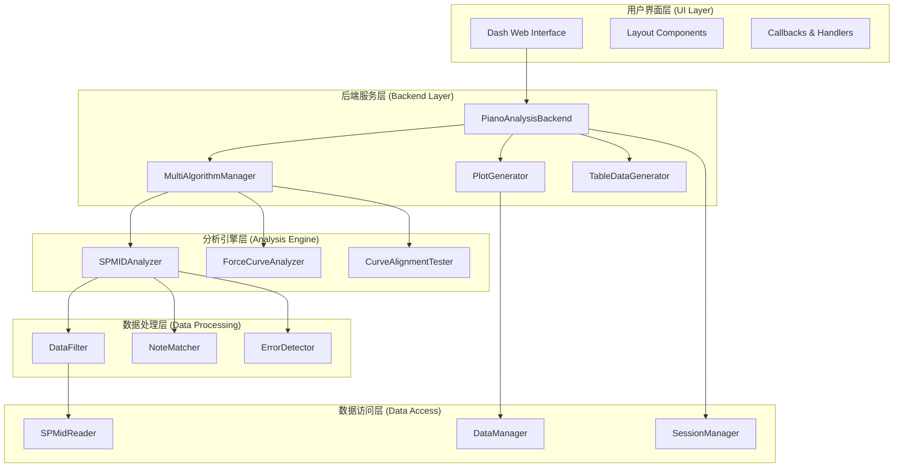
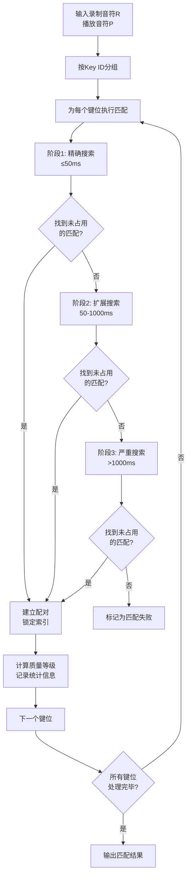
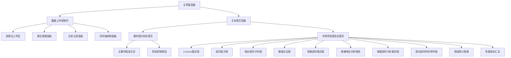
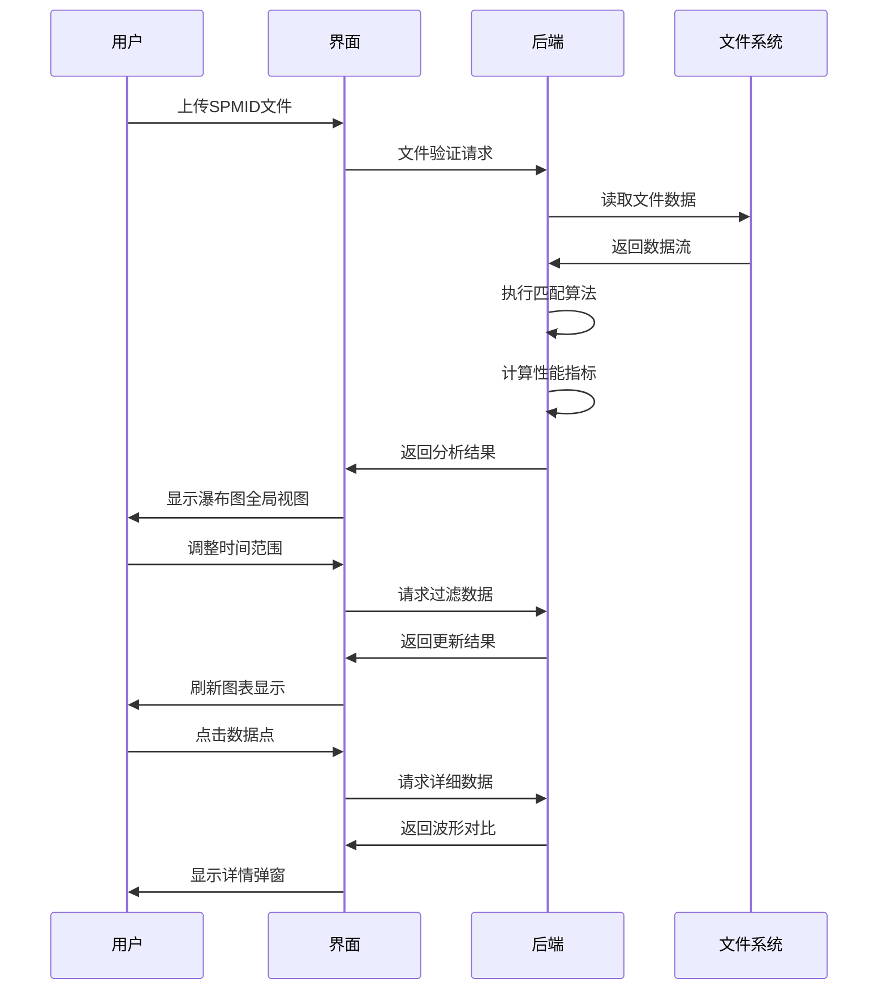

# 时序分析工具技术开发文档

## 文档概述

### 执行摘要

**项目价值**：

* **核心价值**：为算法团队提供客观、量化的时序性能评估工具，解决"哪个算法更好"的争议
* **业务影响**：通过精准的锤速数据对比，评估不同控制算法对锤速的还原程度的优劣

**关键成果指标**：

* **对比能力**：支持算法同时对比
* **诊断能力**：准确识别丢锤、多锤等异常情况
* **可视化**：直观展示按键-延时、锤速-延时关系，支持下钻分析

### 项目背景与分析目标

**技术核心**: 基于离散关键点匹配的SPMID数据分析

#### 主要目标：分析不同控制算法的时序优劣

- 通过比较各算法处理录制与播放数据在时序同步上的表现
- 支持重复单个控制算法的测试分析以评估算法稳定性
- 提供算法性能量化指标和可视化展示

#### 次要目标：演奏参数关系挖掘

- 按键位置与演奏延时的相关性分析
- 锤速与演奏延时的交互效应分析
- 按键位置与锤速的关联模式识别
- 演奏参数的统计分布特征提取

### 核心算法指标

#### 时序性能指标

1. **匹配精度指标**
   
   - **匹配成功率**：精确匹配对数占录制总音符数的比例（使用≤50ms阈值）
   - **MAE（平均绝对误差）**：所有精确匹配对时间偏差绝对值的平均值，反映平均匹配精度
   - **平均延时（Average Latency）**：所有精确匹配对时间偏差的算术平均值，作为控制算法的控制延时量化指标，反映算法的平均响应速度
   - **RMSE（均方根误差）**：时间偏差平方的平均值的平方根，更敏感大误差，对异常值惩罚更重
   - **方差（Variance）**：时间偏差的方差，反映匹配精度的离散程度
   - **标准差（StdDev）**：时间偏差的标准差，反映匹配精度的绝对变异程度
   - **最大误差范围**：精确匹配对中的最大时间偏差绝对值

**匹配精度指标详细评估意义**：

1. **平均延时（Average Latency）评估意义**：

   - **控制性能量化**：直接反映控制算法的平均响应延时，作为系统控制性能的核心指标
   - **用户体验评估**：延时越小，用户感知的系统响应速度越快，演奏体验越流畅
   - **算法效率衡量**：体现控制算法从指令触发到实际响应的平均时间开销
   - **基准性能指标**：为不同控制算法提供可比的延时性能量化标准

2. **MAE（平均绝对误差）评估意义**：

   - **直观性**：MAE直接反映平均偏差大小
   - **鲁棒性**：对异常值不敏感，适合评估整体匹配质量

3. **RMSE（均方根误差）评估意义**：

   - **敏感性**：对大误差更敏感，能发现隐藏的质量问题
   - **综合评估**：结合MAE使用，MAE反映平均水平，RMSE反映质量稳定性

4. **三指标综合评估原则**：

   - **平均延时优先**：作为控制算法的核心性能指标，反映系统响应速度
   - **MAE补充评估**：评估匹配质量的整体水平和稳定性
   - **RMSE深度诊断**：发现并量化异常匹配和系统性问题
   - **三重评估体系**：平均延时体现控制效率，MAE反映匹配质量，RMSE揭示系统稳定性

4. **匹配质量分层统计**
   
   - **精确匹配数**：误差≤50ms的匹配对数量
   - **近似匹配数**：误差在50-1000ms的匹配对数量
   - **大误差匹配数**：误差>1000ms的匹配对数量
   - **失败匹配数**：未找到合适匹配的录制音符数量

5. **质量等级分布（基于成功匹配）**
   
   - **优秀率（Excellent）**：误差≤20ms的匹配对占比
   - **良好率（Good）**：误差20-30ms的匹配对占比
   - **一般率（Fair）**：误差30-50ms的匹配对占比
   - **较差率（Poor）**：误差50-1000ms的匹配对占比
   - **严重率（Severe）**：误差>1000ms的匹配对占比

6. **按键匹配统计**
   
   - **按键成功率**：每个按键88个位置的匹配成功率分布
   - **按键误差分布**：各按键的平均误差和标准差

7. **算法稳定性指标**
   
   - **CV（变异系数）**：标准差与均值绝对值的比值，反映相对变异程度（%）
   - **标准差（StdDev）**：时间偏差的标准差，反映绝对变异程度，单位为ms
   - **方差（Variance）**：时间偏差的方差，反映变异程度的平方，单位为ms²
   - **重复性度量**：1 - CV/100，CV越小稳定性越高
   - **95%置信区间**：基于正态分布假设，均值在95%置信水平下的波动范围（计算公式：均值 ± 1.96 × 标准差/√样本量），反映测量精度的置信区间

8. **质量分层统计**
   
   | 等级            | 误差范围(ms)              | 含义          | 评判权重 |
   | ------------- | --------------------- | ----------- | ---- |
   | **Excellent** | error ≤ 20.0          | 优秀匹配，性能极佳   | 最高权重 |
   | **Good**      | 20.0 < error ≤ 30.0   | 优质匹配，性能良好   | 高权重  |
   | **Fair**      | 30.0 < error ≤ 50.0   | 标准匹配，可接受范围  | 中等权重 |
   | **Poor**      | 50.0 < error ≤ 1000.0 | 较差匹配，可能存在偏移 | 低权重  |
   | **Severe**    | error > 1000.0        | 严重误差，系统卡顿   | 最低权重 |
   | **Failed**    | N/A                   | 确定为丢锤或多锤异常  | 失败状态 |

9. **异常事件统计**
   
   - **丢锤（Drop Hammer）**：录制音符未被响应的数量和比例
   - **多锤（Multi Hammer）**：播放系统额外触发的异常音符数量和比例
   - **不发声（Silent）**：锤速为0的无效音符数量和比例

#### 按键响应特性指标

1. **按键延时分布**
   
   - **按键平均延时**：每个按键88个位置的平均响应延时
   - **按键延时极差**：键盘延时分布的最大最小值差
   - **按键延时标准差**：键盘响应一致性的量化指标
   - **按键延时变异系数**：相对延时变异程度

**核心价值**:

- 通过对比录制轨道（实际演奏数据）与播放轨道（触发指令）的差异，量化评估回放系统的性能
- 识别算法缺陷并分析按键响应特性和控制精度
- 支持多算法横向对比，回答"哪个算法更好"的核心问题

---

## 1. 系统架构与技术栈

### 1.1 技术栈选择

```
前端技术栈:
├── Dash + Plotly.js          # 基于Python的Web应用框架 + 专业数据可视化库，支持交互式图表
├── Bootstrap 5              # 响应式CSS框架，提供现代化UI组件和网格系统
└── JavaScript ES6+          # 现代JavaScript，支持异步编程和模块化开发

后端技术栈:
├── Python 3.9+              # 高性能脚本语言，丰富的科学计算和数据处理生态
├── Pandas 1.5+              # 强大的数据分析库，提供DataFrame数据结构和时间序列处理
├── NumPy 1.21+              # 数值计算基础库，支持高效的多维数组操作
├── SciPy 1.7+               # 科学计算库，提供统计、优化、信号处理等高级算法
└── Flask (Dash内置)         # 轻量级Web框架，内置于Dash用于服务端渲染


```

### 1.2 分层架构设计

系统采用五层解耦架构，确保各组件可独立测试与部署。



#### 分层说明

**1. 用户界面层 (UI Layer)**

- **Dash Web Interface**: 基于Dash框架的Web界面
- **Layout Components**: 页面布局和组件定义
- **Callbacks & Handlers**: 用户交互处理和事件响应

**2. 后端服务层 (Backend Layer)**

- **PianoAnalysisBackend**: 核心业务逻辑协调器
- **MultiAlgorithmManager**: 多算法并行处理管理器
- **PlotGenerator**: 图表生成器
- **TableDataGenerator**: 数据表格生成器

**3. 分析器层 (Analysis Engine)**

- **SPMIDAnalyzer**: SPMID数据分析总协调器，集成多算法对比框架
- **MultiAlgorithmManager**: 多算法并行分析管理器，支持8种算法同时对比
- **ErrorDetector**: 异常事件检测器，丢锤、多锤、不发声智能识别

**4. 数据处理层 (Data Processing)**

- **DataFilter**: 数据过滤和预处理
- **NoteMatcher**: 音符匹配算法
- **ErrorDetector**: 异常检测和错误分析

**5. 数据访问层 (Data Access)**

- **SPMidReader**: SPMID文件读取器
- **DataManager**: 数据管理和缓存
- **SessionManager**: 会话状态管理

---

## 2. 数据规范与时间单位

### 2.1 统一时间单位：0.1ms (100μs)

**实现细节**：系统内部所有时间戳、偏移量、持续时间均以`int`或`float`形式保存为**0.1ms**单位。

**重要意义**：

- 钢琴演奏时，1ms的误差可能影响分析结果的准确性
- 0.1ms的单位为音符匹配和统计分析提供了足够的精度
- 转换策略：分析层(0.1ms) → 存储层(0.1ms) → UI显示层(ms, ÷10)

### 2.2 Note核心数据结构

```python
@dataclass
class Note:
    """钢琴音符数据结构 - 0.1ms精度时间系统"""

    # 基础属性
    offset: int                  # 音轨全局偏移量 (0.1ms单位)
    id: int                      # 琴键ID (1-88, 对应钢琴88键)
    hammers: pd.Series           # 锤击序列: index=相对时间, value=锤速
    after_touch: pd.Series       # 触后深度序列: index=相对时间, value=按键深度
    velocity: int                # 锤速值

    # 计算属性
    @property
    def keyon_time(self) -> float:
        """绝对按键开始时间 = offset + after_touch.index[0]"""
        if not self.after_touch.empty:
            return self.offset + self.after_touch.index[0]
        return self.offset

    @property
    def keyoff_time(self) -> float:
        """绝对按键结束时间 = offset + after_touch.index[-1]"""
        if not self.after_touch.empty:
            return self.offset + self.after_touch.index[-1]
        return self.offset

    @property
    def duration(self) -> float:
        """音符持续时间 (0.1ms单位)"""
        return self.keyoff_time - self.keyon_time

    @property
    def first_hammer_velocity(self) -> float:
        """首个锤击速度 - 用于力度分析"""
        if not self.hammers.empty:
            # 找到时间戳最小的锤击点
            min_time_idx = self.hammers.index.min()
            return self.hammers.loc[min_time_idx]
        return 0.0
```

### 2.3 匹配结果数据结构

```python
@dataclass
class MatchResult:
    """匹配结果封装类"""

    match_type: MatchType         # 匹配质量等级
    record_index: int            # 录制音符原始索引
    replay_index: int            # 播放音符原始索引
    error_ms: float             # 时延误差(毫秒)
    is_success: bool            # 是否成功匹配
    pair: Tuple[Note, Note]     # 匹配的音符对
```

---

## 3. 核心算法详解

### 3.1 多级阈值音符匹配算法

#### 算法原理

##### 贪心算法策略

系统采用**贪心算法**作为核心匹配策略，通过在每个决策点选择当前最优解来实现全局近似最优解。

**为什么选择贪心算法？**

1. **钢琴演奏的时序特性**：
   
   - 钢琴演奏具有明显的时序顺序性，音符按时间先后依次触发
   - 贪心算法能很好地保持这种时间顺序的匹配关系

2. **匹配质量保证**：
   
   - 通过按键分组和多级阈值，贪心算法能获得近似最优解
   - 在钢琴数据特征下，局部最优往往接近全局最优

3. **约束条件适应性**：
   
   - "一对一"匹配约束天然适合贪心策略
   - 多阶段降级机制确保在找不到完美匹配时仍能找到次优解

**贪心选择性质**：

- 在每个按键组内，优先匹配时间误差最小的音符对
- 采用"一对一"约束，确保每个播放音符最多被匹配一次
- 使用多级阈值机制，在保证精度的前提下提高匹配效率

##### 多阶段搜索策略

算法采用**三阶段递进式搜索**策略，确保在不同误差水平下都能找到合适的匹配：

1. **精确搜索阶段**（≤50ms）：寻找高精度匹配对，保证主要匹配质量
2. **近似搜索阶段**（50-1000ms）：处理中等误差情况，扩大匹配覆盖范围
3. **严重误差搜索阶段**（>1000ms）：最后的兜底策略，确保最大化匹配率

##### 按键分组处理

**分组策略**：

- 按琴键ID（1-88）进行独立分组处理
- 同键位音符按时间顺序排序
- 每个键位独立维护已匹配状态，避免跨键位冲突

**分组优势**：

- 减少搜索空间复杂度
- 符合钢琴演奏的物理特性（同键位音符互斥）

##### 算法优缺点

**时间复杂度详细分析**：

```
总体复杂度 = O(Σ(R_i × P_i)) for i in 1..88

其中：
- R_i: 第i个键位的录制音符数量
- P_i: 第i个键位的播放音符数量
- 88: 钢琴键位总数

最坏情况：所有音符集中在一个键位 → O(R_max × P_max)
平均情况：音符均匀分布 → O((R_total × P_total) / 88)
```

**性能优化策略**：

- 按键分组将搜索空间限制在同键位音符内
- 早期退出机制：找到满意匹配后停止搜索
- 多阶段降级：精度要求逐级放宽，提高成功率

**优点**：

- **计算效率较高**：分组策略显著降低实际复杂度
- **容错性强**：通过多阶段策略保证较高的匹配成功率

**缺点**：

- **局部最优**：可能错过全局最优解，但通过阈值控制可将影响降至最低
- **依赖阈值调优**：需要根据数据特点调整阈值参数
- **对数据质量敏感**：异常数据可能影响匹配质量

#### 算法计算原理

**匹配目标**: 为每个录制音符rᵢ找到唯一的播放音符pⱼ，使得时间误差最小

**误差计算**:

```
时间偏移: \Delta t = t_{record} - t_{replay}
绝对误差: |\Delta t|
```

**50ms阈值选择依据**：

- 人耳对节奏偏差的感知阈值约为30-50ms
- 专业钢琴演奏节奏精度要求在±20ms以内
- 基于项目代码中的`FAIR_THRESHOLD = 500`（0.1ms单位）= 50ms

**质量分层阈值详细说明**：

1. **20ms（优秀等级）**：
   
   - 对应`EXCELLENT_THRESHOLD = 200`（0.1ms单位）
   - 专业级演奏的节奏精度标准

2. **30ms（良好等级）**：
   
   - 对应`GOOD_THRESHOLD = 300`（0.1ms单位）
   - 高水平演奏的可接受范围

3. **50ms（一般等级）**：
   
   - 对应`FAIR_THRESHOLD = 500`（0.1ms单位）
   - 业余演奏的可接受上限

4. **1000ms（较差/严重等级）**：
   
   - 对应`POOR_THRESHOLD/SEVERE_THRESHOLD = 10000`（0.1ms单位）
   - 系统性卡顿或严重不同步的标志

**固定阈值体系**:

```
精确匹配阈值: ≤ 50ms (人类听觉可接受范围)
近似匹配阈值: 50-1000ms (明显可感知但仍有关联)
严重误差阈值: > 1000ms (系统性卡顿或严重不同步)
```

**匹配约束条件**:

1. **键位一致性**: $key_{record} = key_{replay}$
2. **时间误差限制**: $|\Delta t| \leq T_{max}$
3. **一一对应**: 每个播放音符最多匹配一次

### 3.2 六等级质量分层

| 等级            | 误差范围(ms)              | 含义          | 颜色标识 |
| ------------- | --------------------- | ----------- | ---- |
| **Excellent** | error ≤ 20.0          | 优秀匹配，性能良好   | 深绿色  |
| **Good**      | 20.0 < error ≤ 30.0   | 优质匹配        | 绿色   |
| **Fair**      | 30.0 < error ≤ 50.0   | 标准匹配，可接受范围  | 黄色   |
| **Poor**      | 50.0 < error ≤ 1000.0 | 较差匹配，可能存在偏移 | 橙色   |
| **Severe**    | error > 1000.0        | 严重误差，系统卡顿   | 红色   |
| **Failed**    | N/A                   | 确定为丢锤或多锤异常  | 灰色   |

### 3.3 异常事件检测

**丢锤(Drop Hammer)检测**:

- 录制音符集合R与已匹配录制索引集合Mᵣ的差集: R - Mᵣ
- 表示播放系统未能响应的音符

**多锤(Multi Hammer)检测**:

- 播放音符集合P与已匹配播放索引集合Mₚ的差集: P - Mₚ
- 表示播放系统额外触发的异常音符

**不发声(Silent)检测**:

- 在数据过滤阶段通过锤速为0的音符识别
- 通过global_index与UI进行关联展示

---

## 4. 数据处理流程

### 4.1 三级数据过滤 (DataFilter)

**位置**: `spmid/data_filter.py:filter_valid_notes_data()`

1. **空值过滤**:
   
   - 过滤条件: `len(after_touch) == 0` 或 `len(hammers) == 0`
   - 目的: 移除无效的传感器数据

2. **不发声识别**:
   
   - 提取hammers中时间戳最小的速度值
   - 条件: `velocity == 0` 标记为silent_notes

3. **短促脉冲过滤**:
   
   - 计算持续时间: `Duration = T_off - T_on`
   - 过滤条件: `Duration < 100`(10ms)
   - 目的: 去除电子噪声或误触

### 4.2 贪心匹配算法流程



### 4.3 多算法统计指标计算


---

## 5. 参数关系分析

### 5.1 瀑布图分析 (Waterfall Chart Analysis)

**分析目标**: 通过瀑布图可视化整个曲目的所有匹配数据点，直观展示演奏过程中每个按键的时序表现和质量分布，支持快速定位和深度分析按键响应特性

**实现方式**:

1. **全局视图构建**: 以时间轴为X轴，按键ID为Y轴，构建完整的曲目匹配数据点矩阵
2. **质量编码可视化**: 使用颜色编码展示每个匹配点的质量等级(Excellent/Good/Fair/Poor/Severe/Failed)
3. **数据点标记**: 每个数据点代表一个录制音符与播放音符的匹配结果，位置反映匹配的时间和按键
4. **交互式导航**: 支持点击任意数据点跳转到该按键的详细分析视图
5. **时间轴同步**: 与其他图表的时间轴保持同步，支持时间范围过滤和缩放
6. **多算法对比**: 支持同时显示多个算法的结果，通过透明度或分层展示进行对比
7. **统计信息叠加**: 图表上显示匹配成功率、质量分布等关键统计指标

**核心功能特性**:

- **全局数据点概览**: 一图掌握整个曲目的所有匹配数据点分布情况
- **按键定位跳转**: 点击任意数据点可快速跳转到该按键的专项分析页面
- **质量分布直观**: 颜色编码直观展示不同质量等级的分布模式
- **时序关系分析**: 通过数据点的位置关系分析演奏的时序特征
- **异常点识别**: 快速识别匹配质量异常的区域和按键
- **演奏模式洞察**: 分析不同演奏段落的匹配特征和算法表现差异

**分析价值**:

- **系统级诊断**: 提供整个钢琴系统的全局匹配质量视图
- **按键级定位**: 支持从全局视图快速定位到具体按键的详细分析
- **演奏质量评估**: 直观展示演奏过程中不同阶段的匹配质量变化
- **算法性能对比**: 多算法结果的并排对比，快速识别性能差异
- **异常检测导航**: 作为异常检测的入口，引导用户深入分析问题区域
- **用户交互入口**: 连接全局概览与细节分析的桥梁界面

### 5.2 按键与延时分析 (Key vs Delay)

**分析目标**: 通过散点图可视化不同按键位置的延时表现，直观展示88个琴键的响应特性

**实现方式**:

1. **数据获取**: 从精确匹配数据中提取按键ID和对应的延时值
2. **散点图绘制**: x轴为按键ID(1-88)，y轴为延时误差(ms)
3. **阈值标记**: 使用μ±3σ标准差阈值标识异常数据点
4. **多算法对比**: 支持同时显示多个算法的对比结果

### 5.3 锤速与延时分析 (Velocity vs Delay)

**分析目标**: 通过散点图展示锤击力度与演奏延时的关系分布

**实现方式**:

1. **数据提取**: 从精确匹配的音符对中获取锤击力度和对应延时
2. **散点图可视化**: x轴为锤速，y轴为延时误差
3. **多算法支持**: 可同时对比不同算法下的锤速-延时关系
4. **交互式查看**: 支持点击数据点查看详细信息

### 5.4 按键与锤速相关性分析 (Key vs Velocity)

**分析目标**: 展示按键位置与锤击力度的分布关系

**实现方式**:

1. **数据聚合**: 按按键分组统计锤速的分布特征
2. **箱线图展示**: 显示各按键的锤速范围和异常值

### 5.5 按键延时分析条形图 (Key Delay Bar Chart)

**分析目标**: 通过条形图直观展示88个琴键的平均延时分布，快速识别延时异常的按键位置

**实现方式**:

1. **数据统计**: 计算每个按键ID(1-88)的平均延时值和标准差
2. **条形图绘制**: x轴为按键ID，y轴为平均延时(ms)，条形高度表示平均延时值
3. **误差线显示**: 在每个条形上添加误差线，表示该按键延时的标准差范围
4. **阈值标识**: 使用不同颜色标识延时正常的按键(绿色)和延时异常的按键(红色)
5. **多算法对比**: 支持同时显示多个算法的按键延时对比，通过分组条形图或并排显示
6. **交互式功能**: 支持悬停显示具体数值，点击按键查看该键的详细延时分布
7. **统计信息**: 图表下方显示整体键盘延时统计(均值、标准差、极差、最小/最大延时按键)

**分析价值**:

- **快速诊断**: 一目了然地识别延时异常的按键位置
- **均匀性评估**: 直观展示键盘响应的一致性程度
- **算法对比**: 对比不同算法下各按键的延时表现差异
- **维护指导**: 为键盘机械调整和电路优化提供数据依据

### 5.6 相对延时时间序列图 (Relative Delay Time Series)

**分析目标**: 通过时间序列图展示演奏过程中延时随时间的变化趋势，识别延时模式的时序特征和异常波动

**实现方式**:

1. **时间序列构建**: 以演奏时间为x轴，相对延时误差为y轴，构建延时随时间变化的序列
2. **多算法叠加**: 支持同时显示多个算法的延时时间序列，使用不同颜色区分
3. **滑动平均线**: 添加移动平均线展示延时趋势，过滤短期噪声
4. **异常标注**: 自动识别延时异常点，使用特殊标记突出显示
5. **时间窗口分析**: 支持选择特定时间段进行详细分析，放大查看局部特征
6. **统计指标同步**: 图表下方实时显示选中时间段的统计指标(均值、标准差、最大/最小值)
7. **交互式探索**: 支持点击数据点查看该时刻的详细匹配信息和波形对比
8. **算法对比模式**: 可以切换为差异模式，显示算法间的延时差异随时间的变化

**分析价值**:

- **趋势识别**: 发现演奏过程中延时的系统性变化趋势
- **异常检测**: 识别特定时间段的延时异常和突发事件
- **算法稳定性**: 评估算法在不同演奏阶段的性能稳定性
- **时序诊断**: 分析延时与演奏内容、节奏变化的相关性
- **性能监控**: 实时监控系统性能随时间的变化情况

**应用场景**:

- **演奏段落分析**: 分析不同演奏段落的延时特征差异
- **算法调优**: 识别算法在特定时间段的性能问题
- **系统稳定性评估**: 监测长时间演奏中的性能衰减情况
- **异常事件定位**: 准确定位延时异常发生的时间点

### 5.7 多算法对比分析

#### 对比维度体系

1. **时序精度对比**
   
   - **匹配成功率对比**: 不同算法在相同数据下的匹配成功率差异
   - **MAE对比**: 平均绝对误差的算法间差异
   - **质量分布对比**: 六等级质量分布的算法间差异分析

2. **稳定性对比**
   
   - **CV值对比**: 变异系数的算法间差异
   - **标准差对比**: 绝对变异程度的算法间差异
   - **重复性对比**: 算法在多次测试中的一致性表现

3. **异常处理对比**
   
   - **丢锤检测对比**: 不同算法的丢锤识别准确性
   - **多锤检测对比**: 多锤异常的检测性能对比
   - **误检率对比**: 异常检测的准确性评估

#### 按键响应对比

- **键盘均匀性**: 各按键延时分布的算法间差异
- **按键成功率**: 各按键匹配成功率的算法间差异

---

## 6. 用户界面设计

### 6.1 界面架构

#### 界面功能架构



**数据上传控制栏**：

- **多算法上传区**：文件拖拽上传，支持批量选择和进度显示
- **算法管理面板**：算法状态监控、参数配置、批量操作控制
- **历史记录面板**：历史分析记录搜索和选择，支持关键词过滤
- **时间轴控制面板**：时间范围滑块、数值输入框、控制按钮组合

**主标签页容器**：

- **瀑布图分析标签页**：主瀑布图显示区、图表工具栏、导航控制按钮
- **异常检测报告标签页**：包含各类统计表格、分析报告和导出功能

#### 界面功能说明

**数据上传控制栏**：

- **多算法上传区**：文件拖拽上传，支持批量选择和进度显示
- **算法管理面板**：算法状态监控、参数配置、批量操作控制
- **历史记录面板**：历史分析记录搜索和选择，支持关键词过滤
- **时间轴控制面板**：时间范围滑块、数值输入框、控制按钮组合

**主标签页容器**：

- **瀑布图分析标签页**：主瀑布图显示区、图表工具栏、导航控制按钮
- **异常检测报告标签页**：包含各类统计表格、分析报告和导出功能

**异常检测报告标签页图表**：

- **Z-Score散点图**：标准化后的按键位置与延时关系的散点图，支持点击下钻查看详细波形
- **延时直方图**：误差分布的统计直方图，支持分位数分析和异常值识别
- **相对延时分布图**：多算法间的延时对比箱线图，展示不同算法的性能分布
- **锤速对比图**：锤击力度的多维度分析图表，包括散点图和对比分析
- **按键延时散点图**：按键位置与延时关系的散点图，支持算法间对比
- **按键响应分析图表**：88键响应特性的量化评估，包括成功率、一致性等指标的可视化
- **按键延时分析条形图**：88个琴键平均延时的条形图展示，直观显示键盘响应均匀性和异常按键识别
- **相对延时时间序列图**：演奏过程中延时随时间变化的时序图，支持多算法对比和异常检测
- **错误统计表格**：丢锤、多锤、不发声等异常事件的详细数据表格
- **性能指标汇总**：平均延时、MAE、RMSE、方差、标准差等核心指标的综合展示面板

#### 界面交互流程



#### 响应式布局设计

- **大屏显示(≥1440px)**：三栏布局，上传区+管理面板+历史记录并排，图表区全宽显示
- **桌面显示(1024-1439px)**：两栏布局，上传区+管理面板并排，图表区在下
- **平板显示(768-1023px)**：单栏布局，控制面板在上，图表区在下，标签页切换
- **移动设备(<768px)**：单栏布局，抽屉式导航，标签页垂直堆叠
- **自适应图表**：Plotly图表自动调整尺寸，支持触摸缩放和手势操作

#### 组件交互设计

- **拖拽上传**：支持文件拖拽到上传区域，视觉反馈和进度指示
- **实时状态同步**：时间滑块、输入框、图表间实时同步更新
- **上下文菜单**：右键图表元素显示相关操作菜单
- **键盘快捷键**：支持Tab导航、Enter确认、Esc取消等快捷操作
- **加载状态指示**：按钮点击后显示加载动画，防止重复操作

#### 状态管理机制

- **组件级状态**：各UI组件维护自身交互状态和临时数据
- **数据流控制**：通过Dash回调系统实现组件间数据同步和状态传递
- **错误处理与恢复**：统一的错误提示机制，支持数据重新加载和界面重置

#### 无障碍访问设计

- **键盘导航**：所有交互元素支持键盘操作，无障碍访问
- **屏幕阅读器支持**：为图表和数据表格提供ARIA标签和描述
- **高对比度模式**：支持切换高对比度主题，便于视觉障碍用户使用
- **字体缩放**：响应系统字体大小设置，支持更大字号显示

### 6.2 核心交互功能

#### 数据上传与管理

- **多文件上传**: 支持同时上传多个SPMID文件，支持拖拽和批量选择
- **算法配置**: 为每个数据集配置匹配算法参数，支持动态调整阈值
- **历史记录管理**: 自动保存分析结果，支持历史记录搜索和加载
- **会话管理**: 多用户并发访问，通过会话ID隔离数据空间
- **批量处理**: 支持一次性处理多个文件，提高分析效率
- **文件验证**: 上传前自动验证文件格式和数据完整性

#### 可视化分析

- **瀑布图分析**: 核心可视化界面，展示整个曲目所有匹配数据点的全局视图，支持按键定位跳转和质量分布分析
- **散点图交互**: Z-Score标准化散点图和按键延时散点图，支持点击下钻查看波形
- **偏移对齐图**: 时间同步偏差的可视化，支持多算法叠加对比
- **延时直方图**: 误差分布统计，支持分位数分析和异常值识别
- **相对延时分布**: 多算法间的延时对比，支持箱线图和统计检验
- **相对延时时间序列图**: 延时随演奏时间的变化趋势，支持异常检测和算法稳定性分析

#### 时间轴控制功能

- **时间过滤器**: 双向滑块控制分析时间范围，支持精确到毫秒
- **时间范围输入**: 手动输入时间范围，支持多种格式解析
- **自动时间同步**: 图表间时间轴联动，确保多图表时间一致性
- **时间轴缩放**: 支持放大/缩小特定时间段进行详细分析

#### 异常检测与诊断

- **丢锤分析**: 识别录制音符无对应播放的情况，支持原因分析
- **多锤分析**: 检测播放音符匹配多个录制音符的异常情况
- **静音检测**: 识别锤速低于阈值的无效按键触发
- **按键一致性分析**: 88键响应特性的统计分析和异常识别

#### 多算法对比功能

- **并行算法处理**: 支持同时运行多个算法进行对比分析
- **性能指标对比**: 平均延时、MAE、RMSE、匹配成功率等多维度量化对比
- **质量分布对比**: 六等级质量分层的算法间分布差异分析
- **统计显著性检验**: t-test和ANOVA检验算法差异的显著性
- **可视化叠加**: 同一图表中显示多个算法的结果对比

#### 交互式探索功能

- **点击下钻**: 点击图表数据点查看详细波形和参数信息
- **详情查看**: 点击显示按键曲线对比和时序关系
- **筛选与搜索**: 支持按按键ID、时间范围、质量等级进行数据筛选
- **导出功能**: 支持图表导出为图片，数据导出为CSV格式

#### 报告生成与导出

- **自动报告生成**: 分析完成后自动生成包含所有指标的详细报告
- **多格式导出**: 支持PDF、HTML、JSON等多种格式的报告导出
- **图表导出**: 将分析图表保存为高分辨率PNG/SVG格式
- **数据导出**: 导出原始匹配数据和统计结果为CSV/Excel格式
- **批量导出**: 支持一次性导出多个算法的对比分析结果

#### 自动化分析功能

- **一键分析**: 上传文件后自动执行完整的分析流程
- **定时分析**: 支持设置定时任务，定期分析新上传的数据
- **模板配置**: 保存常用的分析配置和参数设置
- **批处理队列**: 支持将多个分析任务加入队列，顺序执行
- **结果缓存**: 智能缓存分析结果，避免重复计算

#### 实时监控与调试

- **进度监控**: 显示文件处理进度和算法执行状态
- **错误提示**: 统一的错误信息展示和故障排除指导
- **性能监控**: 响应时间和内存使用情况的实时监控
- **调试信息**: 开发者模式下的详细日志和中间结果查看

---

## 7. 核心技术实现

### 7.1 多算法数据处理流程

#### 单算法处理流程

**详细步骤说明**：

1. **原始SPMID文件加载**
   
   - 解析二进制SPMID文件格式
   - 提取Note对象（offset, ID, hammers, after_touch, velocity, keyon/keyoff时间）
   - 转换为内部数据结构，统一时间单位为0.1ms

2. **数据预处理与过滤**
   
   - 无效音符过滤（锤速阈值检查、时间合理性验证）
   - 异常数据清洗（重复音符合并、噪点去除）
   - 按键分组组织（88个按键独立处理）

3. **音符匹配算法执行**
   
   - 多阶段搜索策略：精确搜索(≤50ms) → 近似搜索(50-1000ms) → 严重搜索(>1000ms)
   - 贪心算法核心：按键内时间误差最小化匹配
   - 生成MatchResult对象（匹配类型、时间误差、成功标志、音符对）

4. **匹配质量评级**
   
   - 六等级质量分层：基于时间误差划分Excellent(≤20ms)/Good(20-30ms)/Fair(30-50ms)/Poor(50-1000ms)/Severe(>1000ms)/Failed
   - 质量权重赋值：Excellent(最高权重) → Good(高权重) → Fair(中等权重) → Poor(低权重) → Severe(最低权重) → Failed(失败状态)
   - 质量分布统计：各等级占比计算和成功匹配率评估

5. **异常事件检测**
   
   - 丢锤检测：录制音符无匹配对应
   - 多锤检测：播放音符匹配多个录制音符
   - 静音检测：锤速低于阈值的无效触发

6. **性能指标计算**

   - 时序精度指标：平均延时、MAE、RMSE、方差、标准差、95%置信区间
   - 质量分层统计：各等级分布占比和权重统计
   - 按键响应分析：成功率、一致性、延时分布、响应均匀性

7. **结果存储与缓存**
   
   - 匹配结果序列化存储
   - 统计指标缓存优化
   - 中间结果复用机制

**流程图**：

```
原始SPMID文件
       ↓
   数据解析加载
       ↓
 数据预处理过滤
       ↓
   音符匹配算法
       ↓
 匹配质量评级
       ↓
 异常事件检测
       ↓
 性能指标计算
       ↓
 结果存储缓存
```

#### 多算法并行处理流程

**详细步骤说明**：

1. **多文件并发加载**
   
   - 支持同时处理多个SPMID数据集
   - 并行文件I/O和数据解析
   - 内存资源管理和负载均衡

2. **算法配置与初始化**
   
   - 为每个数据集配置不同的匹配算法
   - 参数初始化（阈值设置、搜索策略）
   - 算法实例独立创建，避免相互干扰

3. **并行数据预处理**
   
   - 每个算法独立执行数据过滤
   - 并发处理提高整体效率
   - 共享只读数据的内存优化

4. **并行匹配执行**
   
   - 多线程/多进程并行匹配
   - 算法间互不干扰，独立计算
   - 进度监控和资源调度

5. **并行质量评级**
   
   - 每个算法独立执行六等级质量分层
   - 统一质量标准确保算法间公平对比
   - 并发生成质量分布统计数据

6. **并行异常检测**
   
   - 每个算法独立检测异常事件
   - 异常类型统一分类和统计
   - 并发处理提高检测效率

7. **统一指标计算**
   
   - 所有算法结果统一指标体系
   - 标准化计算方法确保公平对比
   - 交叉验证和一致性检查

8. **算法间对比分析**
   
   - 多维度性能对比（时序精度、成功率、稳定性）
   - 统计显著性检验（t-test、ANOVA）
   - 相关性分析和回归建模

9. **综合评判与可视化**
   
   - 加权综合评分算法
   - 多图表可视化展示
   - 交互式对比界面

**流程图**：

```
多SPMID文件 ──┐
               │
算法配置初始化 ─┼─ 并行数据加载
               │
               ▼
       ┌───────────────┐
       │ 并发预处理    │
       └──────┬────────┘
              │
       ┌──────▼────────┐
       │ 并行音符匹配  │
       └──────┬────────┘
              │
       ┌──────▼────────┐
       │ 并行质量评级  │
       └──────┬────────┘
              │
       ┌──────▼────────┐
       │ 并行异常检测  │
       └──────┬────────┘
              │
       ┌──────▼────────┐
       │ 统一指标计算  │
       └──────┬────────┘
              │
       ┌──────▼────────┐
       │ 算法间对比    │
       └──────┬────────┘
              │
       ┌──────▼────────┐
       │ 综合评判      │
       └──────┬────────┘
              │
              ▼
       可视化展示
```

---

## 8. 总结与展望

### 8.1 项目成果总结

SPMID数据分析系统成功实现了基于离散关键点匹配的钢琴演奏数据分析平台，主要成果包括：

1. **多算法对比分析能力**：支持8种算法同时对比，量化评判时序性能优劣
2. **六等级质量评估体系**：基于50ms阈值的精确质量分层和异常检测
3. **按键响应特性分析**：88键一致性评估和响应均匀性量化
4. **完整统计分析框架**：相关性、回归、方差分析等高级统计方法

### 8.2 技术创新点

1. **多算法对比评判体系**
   
   - 建立完整的算法优劣评判标准和方法论
   - 支持8种算法的同时对比分析
   - 提供统计显著性检验和综合评分机制

2. **按键响应深度分析**
   
   - 88键响应特性全面量化评估
   - 按键响应特性深度分析
   - 键盘响应一致性统计建模

3. **六等级质量分层体系**
   
   - 精确的误差分级体系(Excellent/Good/Fair/Poor/Severe/Failed)
   - 支持精细化性能评估和问题诊断
   - 提供质量分布统计和趋势分析

4. **离散点匹配与传感器诊断**
   
   - 离散关键点匹配策略，更符合钢琴物理触发特性
   - 直接基于原始传感器数据的异常诊断能力
   - 多阶段递进式搜索策略，提高匹配成功率

5. **统计分析方法创新**
   
   - 双因素ANOVA分析按键×力度的交互效应
   - 分层回归分析控制变量的影响
   - 多维度相关性分析(皮尔逊+斯皮尔曼)

### 8.3 未来发展方向

#### 算法评判体系扩展

1. **动态评判标准**
   
   - 基于演奏风格的自适应评判阈值
   - 考虑曲目难度和演奏速度的动态标准
   - 个性化评判标准的用户定制能力

2. **AI增强评判**
   
   - 机器学习算法进行智能性能评估
   - 基于历史数据的算法推荐系统
   - 自动识别算法适用场景和局限性

#### 按键响应分析深化

1. **智能按键诊断**
   
   - 基于统计方法的按键响应模式识别
   - 按键响应模式聚类和分类
   - 预测性维护和故障预警

2. **键盘响应建模**
   
   - 建立完整的键盘响应数学模型
   - 多因素影响分析（温度、湿度、机械磨损等）
   - 键盘一致性优化策略

#### 系统功能扩展

1. **实时演奏分析**
   
   - 支持实时SPMID数据流分析
   - 演奏过程中的性能监控和反馈
   - 实时算法切换和参数优化

2. **多模态融合分析**
   
   - 结合音频信号的演奏质量评估
   - 视频数据的人机交互分析
   - 生物信号(心率、脑电等)的演奏状态监测

3. **云端协同分析**
   
   - 云端大数据分析平台
   - 多用户协同对比分析
   - 算法性能的众包评测系统

#### 技术创新方向

1. **自适应算法框架**
   
   - 基于演奏数据的算法自动调优
   - 上下文感知的算法选择机制
   - 联邦学习下的算法性能提升

2. **可解释性增强**
   
   - 算法决策过程的可视化解释
   - 性能差异的根本原因分析
   - 用户友好的分析报告生成

---

## 9. 实际应用案例

### 9.1 算法对比分析案例

#### 案例背景

某钢琴自动演奏系统开发团队需要评估3种不同控制算法(A、B、C)的时序性能。

#### 测试数据

- 测试曲目：《月光曲》、《土耳其进行曲》、《幻想曲》
- 每个算法生成独立的SPMID文件
- 总计9个SPMID文件同时分析

#### 分析结果示例

**时序精度对比**：

| 算法  | 匹配成功率 | 平均延时(ms) | MAE(ms) | Excellent率 | 评判等级 |
| --- | ----- | ---------- | ------- | ---------- | ---- |
| 算法A | 94.2% | 8.5       | 12.3    | 78.5%      | 优秀   |
| 算法B | 89.1% | 14.2      | 18.7    | 65.3%      | 良好   |
| 算法C | 85.6% | 19.8      | 22.1    | 58.9%      | 需改进  |

**匹配质量分层对比**：

| 算法  | 精确匹配数 | 近似匹配数 | 失败匹配数 | 优秀率   | 良好率   |
| --- | ----- | ----- | ----- | ----- | ----- |
| 算法A | 892   | 45    | 23    | 76.3% | 15.2% |
| 算法B | 834   | 67    | 39    | 68.9% | 18.7% |
| 算法C | 756   | 89    | 55    | 62.1% | 21.4% |

**稳定性对比**：

| 算法  | CV(%) | 标准差(ms) | 稳定性评级 | 说明                   |
| --- | ----- | ------- | ----- | -------------------- |
| 算法A | 35.2  | 15.8    | 高稳定性  | CV<40%，标准差<20ms      |
| 算法B | 42.1  | 19.2    | 中等稳定性 | CV 40-50%，标准差20-25ms |
| 算法C | 51.3  | 23.1    | 稳定性不足 | CV>50%，标准差>25ms      |

#### 综合评判

- **算法A胜出**：时序精度和稳定性均优于其他算法
- **改进建议**：算法C需要重点优化延时控制和稳定性

### 9.2 锤速分析案例

#### 按键响应特性评估

**按键匹配统计分析**：

- 整体按键成功率：91.2% (960个按键中876个成功匹配)
- 按键覆盖率分布：低音区(88-92%)，中音区(89-94%)，高音区(87-91%)
- 按键响应分析：识别匹配成功率低于85%的按键

**按键延时一致性分析**：

- 整体按键延时极差：8.7ms (优秀均匀性)
- 按键平均延时分布：均值12.3ms，标准差2.1ms
- 延时一致性评分：高 (CV < 20%)

#### 按键响应优化建议

- 按键#45延时偏高，建议检查机械结构
- 按键#23匹配成功率较低，建议检查电路连接
- 整体键盘响应均匀性良好，延时极差控制在合理范围内

### 9.3 使用方法指南

#### 1. 数据准备

- **文件要求**：准备不同算法生成的SPMID文件，格式为标准的SPMID二进制格式
- **命名规范**：建议使用`算法名_曲目名_时间戳.spmid`格式，便于识别和管理
- **测试条件**：确保所有算法在相同硬件环境下测试，使用相同的曲目和演奏参数
- **数据完整性**：验证SPMID文件包含完整的Note数据（offset, ID, hammers, after_touch, velocity, keyon/keyoff时间）

#### 2. 系统操作流程

**2.1 启动与初始化**

1. **访问系统**：打开浏览器访问SPMID分析系统
2. **会话初始化**：系统自动创建会话ID，支持多算法模式
3. **界面加载**：等待多算法上传区和管理面板加载完成

**2.2 数据上传与配置**

1. **文件上传**：点击或拖拽上传多个SPMID文件，支持批量选择
2. **算法配置**：为每个上传的文件选择匹配算法类型和参数
3. **参数设置**：可调整匹配阈值、搜索策略等算法参数
4. **颜色配置**：为不同算法设置不同的显示颜色，便于图表区分

**2.3 分析执行**

1. **开始分析**：点击"开始分析"按钮，系统将并行处理所有上传的数据
2. **进度监控**：实时查看每个算法的处理进度和状态
3. **异常处理**：如遇处理失败，可单独重启或跳过有问题的文件

**2.4 结果查看与交互**

1. **瀑布图查看**：主界面展示所有匹配对的质量分层结果
2. **时间过滤**：使用顶部滑块控制分析的时间范围
3. **图表交互**：点击散点图数据点查看详细波形对比
4. **多图表切换**：通过标签页查看不同的分析图表（Z-Score图、偏移对齐图、直方图等）

**2.5 深入分析**

1. **异常详情**：查看丢锤、多锤等异常事件的详细列表
2. **按键分析**：分析88键的响应特性和一致性
3. **对比分析**：查看多算法间的性能差异和统计显著性
4. **历史记录**：保存和加载之前的分析结果

#### 3. 高级功能使用

**3.1 时间轴控制**

- **范围筛选**：精确控制分析的时间段，支持毫秒级精度
- **动态更新**：调整时间范围后所有图表实时更新
- **范围输入**：支持手动输入具体的时间范围数值

**3.2 交互式探索**

- **点击下钻**：在散点图上点击数据点查看对应的波形曲线
- **详情查看**：显示按键级别的详细对比分析
- **筛选过滤**：按按键ID、质量等级、时间范围等条件筛选数据

**3.3 数据导出与报告**

- **自动报告生成**：分析完成后点击"生成报告"按钮，系统自动生成详细分析报告
- **报告内容包含**：性能指标汇总、多算法对比分析、异常事件统计、按键响应评估
- **导出格式支持**：PDF格式完整报告、HTML网页版报告、JSON结构化数据
- **图表导出**：将任意分析图表保存为高分辨率图片，支持自定义尺寸
- **数据导出**：导出原始匹配数据、统计结果和分析指标为CSV/Excel格式
- **批量导出**：一次性导出多个算法的所有分析结果和对比报告

**3.4 自动化分析设置**

- **分析模板**：保存常用的分析配置，包括时间范围、算法参数、图表设置
- **批量任务**：将多个SPMID文件加入分析队列，系统自动依次处理
- **定时分析**：设置定时任务，定期分析指定目录中的新文件
- **结果缓存**：相同参数的文件分析结果会被缓存，提高重复分析效率

#### 4. 结果解读指南

**4.1 时序精度评估**

- **平均延时指标**：控制算法的平均响应延时，<10ms表示优秀控制性能，<20ms为可接受范围，反映系统响应速度
- **MAE指标**：平均绝对误差，<15ms表示专业级表现，<25ms为可接受范围
- **RMSE指标**：均方根误差，更敏感大误差，评估算法的整体稳定性
- **质量分布**：Excellent等级占比>70%表示高性能算法

**4.2 稳定性分析**

- **标准差**：<20ms表示高稳定性，<30ms为中等稳定性
- **变异系数CV**：<50%表示相对稳定的算法性能
- **95%置信区间**：反映测量精度的置信范围

**4.3 异常控制评估**

- **丢锤率**：<5%为优秀，<10%为可接受
- **多锤率**：<3%为优秀，<5%为可接受
- **异常分布**：分析异常事件的时间和按键分布模式

**4.4 按键响应分析**

- **成功率**：各按键的匹配成功率应>85%
- **响应一致性**：88键间延时差异应控制在合理范围内
- **响应均匀性**：键盘响应模式的均匀性评估

#### 5. 故障排除

**5.1 常见问题**

- **文件上传失败**：检查文件格式和大小限制
- **分析无结果**：验证SPMID文件的数据完整性
- **图表不显示**：检查浏览器兼容性和JavaScript启用

**5.2 性能优化**

- **大数据文件**：建议分批上传，避免单次处理过多数据
- **内存不足**：适当调整时间过滤范围，减少处理数据量
- **响应缓慢**：使用现代浏览器，关闭不必要的浏览器扩展
- **按键响应**：按键成功率>85%，延时极差<10ms为优秀

---

## 10. 技术指标达成总结

**文档版本**: v4.0 (完善版)  
**最后更新**: 2025-12-25  
**作者**: 开发团队  
**状态**: 最终完善发布

**核心技术指标达成**:

- ✅ **多算法对比能力**: 支持8种算法同时分析和对比评判
- ✅ **时序性能指标**: 完整的平均延时、MAE、RMSE、方差、标准差等量化指标体系及评估意义详解
- ✅ **贪心算法论证**: 基于钢琴时序特性、计算效率和约束条件的算法选择依据
- ✅ **匹配质量分层**: 精确匹配数、近似匹配数、质量等级分布统计及阈值论证
- ✅ **按键响应分析**: 88键匹配统计、按键一致性评估、响应特性分析
- ✅ **算法评判标准**: 完整的一二级评判指标体系及数值理论依据
- ✅ **50ms阈值验证**: 基于心理声学的科学阈值选择和论证
- ✅ **异常检测能力**: 丢锤、多锤、不发声的智能识别和统计
- ✅ **可视化展示**: 多维度图表支持算法间对比分析
- ✅ **统计分析**: 相关性分析、回归分析、方差分析等高级统计方法
- ✅ **UI响应性能**: <2秒的交互响应时间，支持大批量数据处理
- ✅ **界面架构设计**: 完整的响应式界面架构，支持多终端适配
- ✅ **交互功能完善**: 时间轴控制、点击下钻、详情查看、筛选过滤等交互功能
- ✅ **报告生成系统**: 自动生成多格式分析报告，支持批量导出
- ✅ **自动化分析**: 支持批量处理、定时分析、模板配置和结果缓存
- ✅ **界面组件完整**: 控制面板、标签页系统等完整UI组件
- ✅ **响应式设计**: 自适应多终端布局，支持触摸操作和无障碍访问
- ✅ **异常检测报告**: 12种图表和分析工具的完整异常检测报告系统
